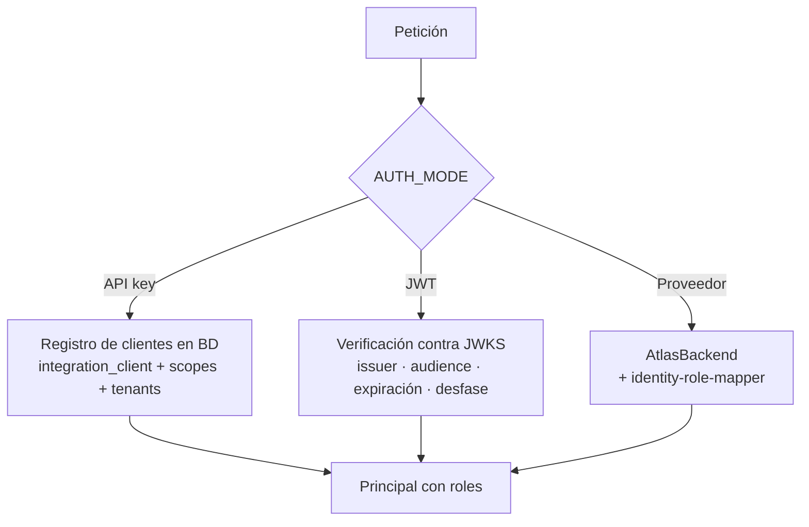

# Autenticación

## Modos

`AUTH_MODE` decide cómo se resuelve el principal. **Producción rechaza `API_KEY` puro.**

| Modo | Portal | Integraciones | Permitido en producción |
| --- | --- | --- | --- |
| `API_KEY` | — | `x-api-key` | ❌ (el esquema lo rechaza) |
| `JWT` | Bearer | Bearer | ✅ |
| `HYBRID` | Bearer | Bearer o API key | ✅ |
| `IDENTITY_PROVIDER` | Sesión del portal | — | ✅ |
| `IDENTITY_HYBRID` | Sesión del portal | API key | ✅ |

## De dónde salen la identidad y los roles

!!! danger "El llamante nunca declara quién es"
    No existen `x-principal-id` ni `x-roles`. Con una API key, **la clave es lo único que el
    llamante aporta**: sus roles, sus tenants permitidos y su audiencia salen de la base de
    datos. Es lo que impide que rotar una clave conceda permisos que nadie autorizó.

## API keys

- Se guardan como **hash**; el valor en claro solo existe en la configuración del llamante.
- Tienen audiencia (`management` o `runtime`): una clave de runtime no puede administrar.
- Rotar el secreto configurado **invalida el anterior**: la siembra borra las credenciales previas del cliente.
- `lastUsedAt` se actualiza con una ventana de 5 minutos para no escribir en cada petición.
- `PLATFORM_ADMIN` **no** se honra como comodín en una API key. Por eso el cliente de gestión de arranque recibe explícitamente cada rol de plataforma.

## JWT

Se verifican emisor, audiencia (distinta para gestión y runtime), expiración y desfase de
reloj (`JWT_CLOCK_SKEW_SECONDS`). Las claves se obtienen de JWKS con caché
(`JWT_JWKS_CACHE_SECONDS`) y timeout propio. En producción la URL debe ser HTTPS.

## Sesión del portal

`POST /v1/session/login` delega en el proveedor de identidad y devuelve el token de acceso más
una **cookie de refresco** (`IDENTITY_REFRESH_COOKIE_NAME`). El endpoint está limitado por
`IDENTITY_SESSION_RATE_LIMIT` y los fallos alimentan `AUTH_FAILURE_RATE_LIMIT`.

Un cambio de contraseña obligatorio o un desafío de segundo factor se devuelven como estado
del flujo, no como error de credencial.

## Denegaciones

Todo `401`/`403` se registra en `decision_access_audit` con estado, recurso, IP y ventana. La
escritura es *fire-and-forget*: la respuesta no espera a la auditoría y un fallo de auditoría
nunca cambia el estado devuelto. Si la base de datos no está disponible, la cola en memoria
—acotada por `ACCESS_AUDIT_QUEUE_MAX`— absorbe el hueco y reintenta.
