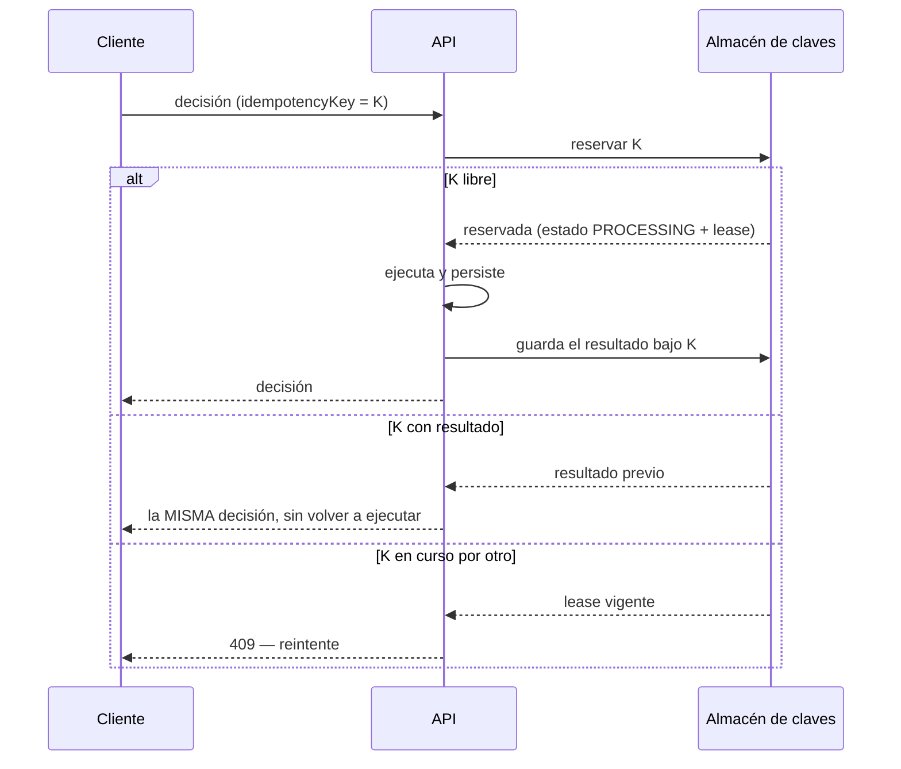

# Idempotencia

## El problema

Un canal de originación reintenta ante un timeout. Sin idempotencia, ese reintento produciría
**una segunda decisión de crédito** para la misma solicitud: dos evaluaciones, dos registros
de evidencia y, potencialmente, dos resultados distintos si algún dato cambió entre medias.

## Cómo se resuelve

`POST /v1/decisions/{artifactCode}` acepta `idempotencyKey` en el cuerpo.

## Las dos duraciones, y por qué son dos

| Parámetro | Valor por defecto | Qué acota |
| --- | --- | --- |
| `IDEMPOTENCY_TTL_HOURS` | 24 h | Cuánto tiempo un reintento sigue devolviendo la misma respuesta |
| `IDEMPOTENCY_LEASE_SECONDS` | 60 s | Cuánto queda bloqueada la clave mientras se procesa |

!!! important "Por qué el lease es corto"
    Si el proceso que tiene la clave muere a mitad de la ejecución, con un solo TTL la clave
    quedaría bloqueada **24 horas** y esa solicitud sería imposible de reintentar. Con el lease,
    se libera en segundos y el siguiente intento la reclama.

    `IDEMPOTENCY_LEASE_SECONDS` estuvo declarado en `.env` pero **no** en el esquema de
    validación, y como el esquema descarta las claves desconocidas, el valor se ignoraba en
    silencio y el servicio caía a sus 60 s por defecto. Está corregido y es la razón por la que
    toda variable que el código lee debe estar declarada.

## Retención

`decision_runtime_idempotency` es la tabla de mayor volumen: cada decisión reserva una fila.
Una purga en segundo plano borra las expiradas por lotes acotados
(`RUNTIME_RETENTION_SWEEP_*`), con un margen de gracia adicional
(`RUNTIME_IDEMPOTENCY_RETENTION_GRACE_HOURS`) para que un reintento que compite con la expiración
no se quede sin su fila.

## Recomendaciones para el integrador

1. **Derive la clave de su propia solicitud**, no de un aleatorio por intento: un UUID nuevo en cada reintento anula la protección.
2. **Reintente ante `503` y `429`**, respetando `retry-after`.
3. Ante `409`, espere y reintente: otro proceso tiene la clave.
4. Guarde el `executionId` devuelto: es la referencia para auditoría y reclamaciones.
