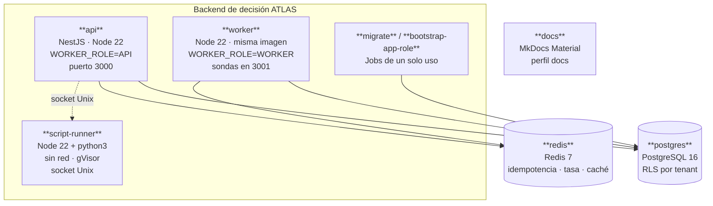

# Contenedores (C4 nivel 2)

## Por qué cada contenedor existe

| Contenedor | Existe porque | Escala por |
| --- | --- | --- |
| `api` | Atiende decisiones y gestión | Tráfico y p95 de decisión |
| `worker` | Los trabajos de cola competían por el pool de conexiones de las réplicas sensibles a latencia | Profundidad de la cola del outbox y de corridas |
| `script-runner` | Un `vm` de Node **no** es una frontera de seguridad del sistema operativo | Concurrencia de nodos de script |
| `migrate` | El esquema debe aplicarse antes de que la aplicación arranque, no durante | — |
| `bootstrap-app-role` | La contraseña del rol de aplicación no puede vivir en una migración versionada | — |
| `postgres` | Estado, evidencia y aislamiento | Vertical y réplicas de lectura |
| `redis` | Idempotencia y límite de tasa consistentes entre réplicas | Vertical |
| `docs` | La versión de MkDocs forma parte del resultado | — |

!!! important "`api` y `worker` comparten imagen a propósito"
    Son el mismo `AppModule` con distinto arranque (`dist/main.js` frente a `dist/worker.js`).
    Publicar dos imágenes permitiría que una corriera código más viejo que la otra sobre el
    mismo esquema de base de datos.

## Endurecimiento aplicado a los contenedores de aplicación

| Control | `api` | `worker` | `script-runner` |
| --- | :---: | :---: | :---: |
| `read_only` raíz | ✓ | ✓ | ✓ |
| `cap_drop: ALL` | ✓ | ✓ | ✓ |
| `no-new-privileges` | ✓ | ✓ | ✓ |
| Usuario no root | ✓ | ✓ | ✓ |
| Sin red | — | — | ✓ |
| Runtime gVisor (`runsc`) | — | — | ✓ |
| Cotas de CPU, memoria y pids | — | — | ✓ |
| `HEALTHCHECK` | ✓ | ✓ | — |

Como la raíz es de solo lectura, escribir un fichero de registro exige montar un volumen y
activarlo explícitamente (`LOG_OUTPUT=stdout_and_file`).

Detalle de despliegue en [operación / despliegue](../operations/deployment.md).
