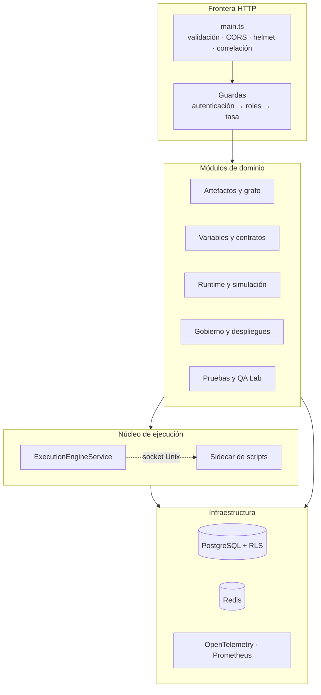

# Panorama de la arquitectura

## Principio rector

**El editor es la fuente de diseño; el runtime ejecuta un artefacto compilado e inmutable.**
Todo lo demás se deriva de ahí: por qué una versión aprobada no se puede tocar, por qué la
definición de un campo calculado viaja congelada dentro del artefacto y por qué una decisión
de hace un año se puede reproducir hoy.

## Capas

## Decisiones estructurales y su porqué

| Decisión | Por qué | Consecuencia |
| --- | --- | --- |
| Un módulo por dominio, registrado en `app.module.ts` | Las dependencias quedan revisables en un solo fichero | Un módulo nuevo es una línea explícita, no un descubrimiento automático |
| Colaboración opcional **por argumento**, no por constructor | Evita dependencias circulares entre dominios | `ArtifactReferenceResolver` y `onStep` se pasan a `execute()`; quien no los necesita los omite |
| Errores centralizados (`DomainException` → filtro global) | Un solo sobre de error para toda la API | Ningún controlador formatea errores; el catálogo se genera del código |
| Configuración validada con Zod al arrancar | Un valor inválido detiene el arranque | Nunca se degrada el comportamiento en caliente por configuración |
| Artefacto compilado con checksum | Reproducibilidad | El runtime no lee el grafo de edición |
| Outbox transaccional | Un evento no puede existir sin su cambio de negocio, ni al revés | Entrega al menos una vez; los consumidores deduplican |
| RLS en el motor y rol no superusuario | El aislamiento no depende de que ningún `where` se olvide | La conexión de aplicación **no** puede ser superusuario |
| Código importado fuera del proceso | Un `vm` de Node no es una frontera del sistema operativo | Sidecar sin red, capacidades eliminadas, gVisor |

## Qué NO hay, a propósito

- **Sin broker de mensajes.** El outbox se despacha a un bus en proceso. Añadir Kafka o RabbitMQ resolvería un problema que este sistema todavía no tiene y añadiría un modo de fallo más.
- **Sin planificador externo.** Cada trabajo de fondo se replanifica solo con un temporizador `unref`'d.
- **Sin ORM que genere las migraciones.** Se escriben a mano y se aplican con `migrate deploy`.
- **Sin particionado temporal** de `decision_execution` / `decision_audit_event`: la decisión está documentada y justificada en `docs/PENDIENTES-*` — Postgres exigiría la clave de partición en toda restricción única, lo que forzaría claves compuestas en cinco tablas referenciantes que Prisma no puede modelar hoy.

Siguiente: [contexto del sistema](system-context.md) · [contenedores](containers.md).
