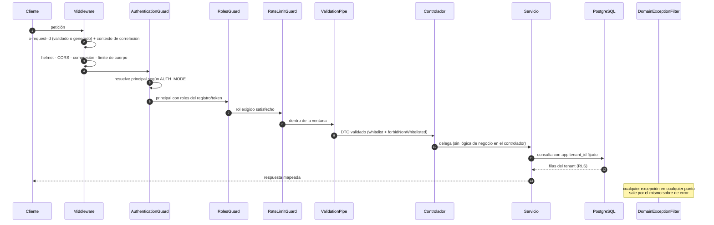

# Ciclo de vida de una petición

## Orden exacto

## Qué garantiza cada paso

| Paso | Garantía | Si falla |
| --- | --- | --- |
| Correlación | Todo registro y toda respuesta llevan el mismo `x-request-id` | Se genera uno; un valor recibido con forma sospechosa se descarta |
| CORS | Solo los orígenes declarados; `x-principal-id`/`x-roles` **no** están permitidas | Petición sin cabeceras de CORS |
| Autenticación | El principal sale del registro de clientes o del token firmado | `401` |
| Autorización | Rol exigido por la ruta, decidido en el servidor | `403` |
| Límite de tasa | Ventana separada para gestión y runtime; cabeceras `x-ratelimit-*` | `429` con `retry-after` |
| Validación | `whitelist` + `forbidNonWhitelisted`: un campo no declarado es un error, no se ignora | `400` |
| Ejecución | Tenant fijado como GUC en la conexión | RLS filtra aunque el `where` se olvide |
| Error | Sobre único, con `requestId` y código estable | Todo error, incluido el no controlado |

!!! note "Por qué `forbidNonWhitelisted` y no solo `whitelist`"
    Ignorar en silencio un campo desconocido hace que un integrador crea que envió algo que
    nunca llegó. Rechazarlo convierte un malentendido silencioso en un error inmediato.

## Ruta de decisión, con sus particularidades

1. **Reserva de idempotencia** antes de trabajar: si la clave ya tiene resultado, se devuelve ese mismo.
2. **Resolución del despliegue** activo para el artefacto y el ambiente (con caché por tenant).
3. **Resolución de variables**, incluidas las externas — **fuera** de cualquier transacción, porque no se abre una transacción alrededor de E/S de red.
4. **Ejecución** del artefacto compilado, acotada por `MAX_EXECUTION_STEPS`.
5. **Persistencia** de ejecución, snapshot, traza, razones, revisión manual y evento de auditoría en **una sola** transacción.
6. **Liberación** de la clave de idempotencia con el resultado.

## Apagado ordenado

`SIGINT`/`SIGTERM` cierran Nest —lo que drena los trabajos en vuelo— y además **vacían las
trazas** de OpenTelemetry, cuyo SDK arranca antes que Nest y queda fuera de su ciclo de vida.
Sin ese vaciado se perderían justo los spans de la ventana de apagado, que es cuando una
petición fallida es más interesante.
