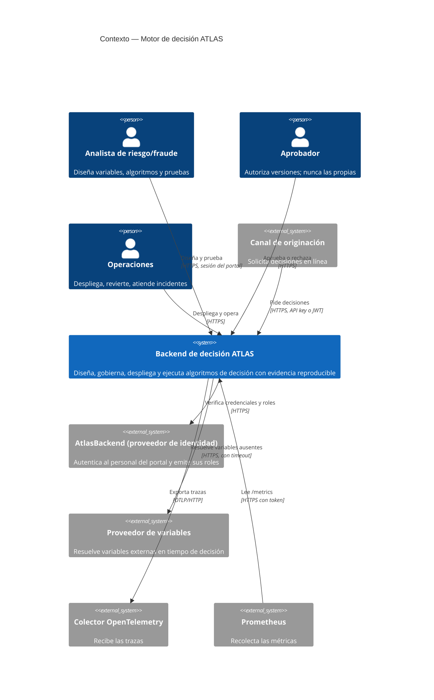

# Contexto del sistema (C4 nivel 1)

## Fronteras de confianza

| Frontera | Qué la cruza | Control |
| --- | --- | --- |
| Internet → API | Peticiones de canales e integraciones | Autenticación, roles, límite de tasa, validación estricta del cuerpo |
| API → proveedor de variables | Consulta de variables externas | Timeout acotado; la resolución ocurre **fuera** de la transacción; en producción exige HTTPS |
| API → proveedor de identidad | Verificación de credenciales | Reintento solo ante fallo transitorio, **nunca** ante credencial rechazada |
| API → sidecar de scripts | Código importado a ejecutar | Socket Unix, sin red, capacidades eliminadas, gVisor, cotas de CPU, memoria y pids |
| API → base de datos | Todo el estado | Rol **no** superusuario para que RLS aplique |

## Lo que el sistema NO hace

- No origina la solicitud de crédito: la recibe ya formada.
- No entrena modelos.
- No es la fuente de verdad de la identidad del personal: delega en el proveedor.
- No almacena el dato sensible en claro en la evidencia: guarda HMAC.

## Suposiciones

1. El proveedor de identidad es alcanzable cuando el portal está en uso; las integraciones por API key no dependen de él.
2. Redis está disponible en producción; sin él el arranque se rechaza porque idempotencia y límite de tasa serían inconsistentes.
3. El reloj de los nodos está sincronizado dentro del margen configurado (`JWT_CLOCK_SKEW_SECONDS`).
