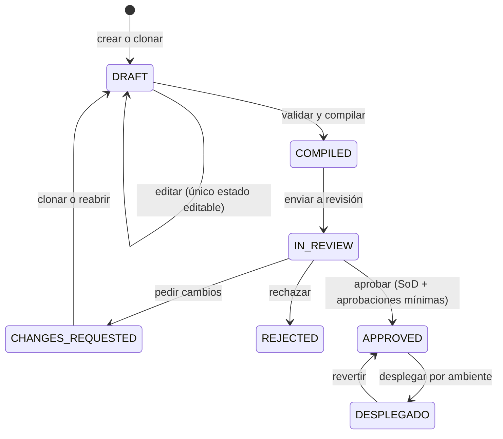
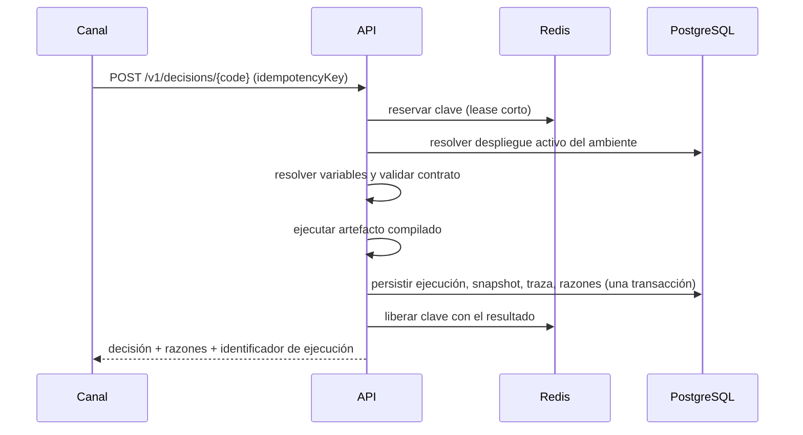

# Flujos críticos

## 1. Publicar una versión de un algoritmo

**Actor principal:** analista de riesgo; **aprobador:** rol distinto del autor.

| Paso | Regla que se aplica | Rechazo si falla |
| --- | --- | --- |
| Editar | Solo un borrador es editable | `VERSION_IMMUTABLE` |
| Compilar | Validación de estructura, expresiones, determinismo y contrato de salida | Informe con errores por nodo |
| Enviar a revisión | La versión debe estar compilada | `VERSION_NOT_REVIEWABLE` |
| Aprobar | **El autor no puede aprobar su propia versión** | Violación de segregación de funciones |
| Aprobar | Orden de los pasos y rol exigido por paso | Paso fuera de orden / rol ausente |
| Desplegar a PROD | Versión aprobada y pruebas superadas | Despliegue rechazado |

`APPROVAL_REQUEST_EXISTS` no se alcanza con un doble envío normal: el primero deja la versión
en revisión y salta antes `VERSION_NOT_REVIEWABLE`. Solo cubre un estado inconsistente.

## 2. Decidir en línea

- **Reintento con la misma clave** devuelve la misma ejecución, no una nueva decisión.
- Un titular que muere libera la clave al vencer el lease, en segundos.
- La resolución de variables externas ocurre **antes** de abrir la transacción: nunca hay E/S de red dentro de ella.

## 3. Someter un cambio a QA antes de aprobarlo

Suite de regresión determinista por versión más, opcionalmente, una corrida generativa guiada
por contrato. Un contraejemplo se archiva **reducido** al mínimo que sigue fallando, con su
semilla, y se puede reejecutar contra la versión que lo produjo.

PROD está excluido del QA Lab por diseño: miles de ejecuciones sintéticas contaminarían
métricas y datos reales.

## 4. Derivar a revisión manual

Un nodo `MANUAL_REVIEW` crea un caso con cola, prioridad, SLA y evidencia. La decisión queda
`MANUAL_REVIEW` hasta que un analista la resuelve.

## 5. Responder a una reclamación

1. Localizar la ejecución por `requestId` o referencia de sujeto.
2. Recuperar su snapshot de variables, la ruta recorrida y las razones.
3. Verificar la cadena de auditoría del tenant (`/v1/audit/chain/verify`).
4. Reproducir la decisión con el mismo artefacto compilado.

El paso 4 es posible porque el artefacto es inmutable y la definición de cada campo calculado
viaja **congelada dentro** de él: cambiar el campo después no altera lo ya decidido.
