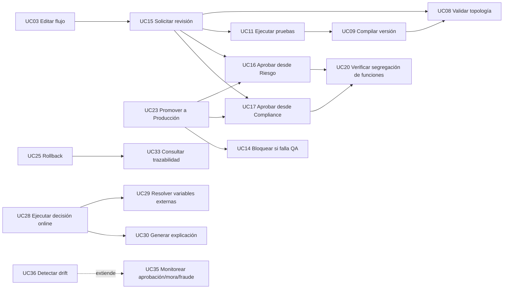

# Casos de uso

Catálogo completo de lo que un actor puede hacer con la plataforma, agrupado por la misma
etapa de vida que atraviesa un algoritmo: diseño, validación, gobierno, despliegue, operación y
auditoría. La fuente original es `docs/plantuml/03_casos_uso_detallados_y_segregacion.puml`
(37 casos de uso, 10 actores) — fuera del portal por diseño, ver `docs/plantuml/README.md` para
compilarla a imagen; esta página la trae al portal en formato tabla y corrige la asignación de
actores contra el catálogo de roles **real** del código, que es posterior a ese diagrama.

!!! info "Por qué los actores no son una copia literal del diagrama fuente"
    El diagrama original usa nombres de actor (`Business Approver`, `Platform Admin`) anteriores
    al catálogo de roles que hoy vive en `src/common/security/platform-roles.ts` y se documenta
    en [actores y roles](actors-and-roles.md). Dos ajustes, ambos deliberados:

    - **Aprobar desde Riesgo** (UC16) se reasigna en exclusiva a `RISK_APPROVER`. El diagrama
      original también se lo atribuía al analista autor (`Risk Analyst`), lo que contradice la
      segregación de funciones que el servicio de gobierno aplica de verdad: el autor de una
      versión nunca puede aprobarla.
    - El paquete de **Despliegue** se atribuye a `OPERATIONS` — la descripción real de ese rol
      en el catálogo de actores ("despliega, revierte, opera incidentes") — y no a un actor
      "Platform Admin" separado. `PLATFORM_ADMIN` sigue siendo el comodín global que puede
      ejecutar cualquier caso de uso, pero solo se honra en identidades firmadas por el
      proveedor de identidad, nunca en una API key (ver [actores y roles](actors-and-roles.md)).

    Ningún caso de uso, paquete ni relación de inclusión/extensión del diagrama original se
    eliminó: solo se corrigió a qué actor pertenece.

## Actores

| Actor | Naturaleza | Detalle |
| --- | --- | --- |
| `RISK_ANALYST` | Rol de plataforma | Autoría de artefactos y variables de crédito |
| `FRAUD_ANALYST` | Rol de plataforma | Autoría en el dominio de fraude |
| `QA_ANALYST` | Rol de plataforma | Suites de prueba y QA Lab |
| `RISK_APPROVER` | Rol de plataforma | Aprobación de versiones — nunca el autor |
| `COMPLIANCE` | Rol de plataforma | Revisión de cumplimiento y evidencia |
| `AUDITOR` | Rol de plataforma | Solo lectura sobre auditoría y ejecuciones |
| `OPERATIONS` | Rol de plataforma | Despliegues, rollback, incidentes, revisión manual |
| `PLATFORM_ADMIN` | Rol de plataforma | Comodín global; solo vía proveedor de identidad |
| Canal de originación | Integración técnica (API key o JWT) | Pide decisiones en línea; no es un rol de RBAC |
| BI / Monitoreo | Consumidor de exportaciones | Lee métricas y tableros; no autentica contra la API |

Detalle completo, incluida la regla de resolución de identidad: [actores y roles](actors-and-roles.md).

## Catálogo por paquete

### Diseño

| Código | Caso de uso | Actor(es) | Detalle |
| --- | --- | --- | --- |
| UC01 | Crear artefacto | `RISK_ANALYST` | [Módulo artifacts](../modules/artifacts.md) |
| UC02 | Clonar versión | `RISK_ANALYST` | Solo desde `DRAFT` o clonando una versión existente — [flujos críticos](critical-workflows.md) |
| UC03 | Editar flujo visual | `RISK_ANALYST`, `FRAUD_ANALYST` | [Módulo graph](../modules/graph.md) |
| UC04 | Definir condiciones | `RISK_ANALYST`, `FRAUD_ANALYST` | Incluido por UC03 |
| UC05 | Definir acciones y reason codes | `RISK_ANALYST`, `FRAUD_ANALYST` | Incluido por UC03 |
| UC06 | Gestionar dependencias de variables | `RISK_ANALYST` | [Contratos de variables](../variable-contracts.md) |
| UC07 | Comparar versiones | `RISK_ANALYST` | Frente a `sourceVersionId` — [relaciones de diseño](../data/relationships.md#1-diseno-del-algoritmo) |

### Validación y pruebas

| Código | Caso de uso | Actor(es) | Detalle |
| --- | --- | --- | --- |
| UC08 | Validar topología y semántica | *(incluido, sin actor directo)* | Se invoca desde UC09 y UC15, no directamente |
| UC09 | Compilar versión | *(incluido, sin actor directo)* | Se invoca desde UC11 y UC15 |
| UC10 | Crear suite de pruebas | `QA_ANALYST` | [Módulo testing](../modules/testing.md) |
| UC11 | Ejecutar pruebas deterministas | `QA_ANALYST` | Incluye UC09 |
| UC12 | Ejecutar regresión masiva | `QA_ANALYST` | Incluye UC11; ver [QA Lab](../calculated-fields.md) |
| UC13 | Medir cobertura de nodos/rutas | `QA_ANALYST` | Incluye UC11 |
| UC14 | Bloquear promoción si falla QA | `QA_ANALYST` | Precondición de UC23 |

### Gobierno

| Código | Caso de uso | Actor(es) | Detalle |
| --- | --- | --- | --- |
| UC15 | Solicitar revisión | `RISK_ANALYST` | Incluye UC08 y UC11; exige versión `COMPILED` |
| UC16 | Aprobar desde Riesgo | `RISK_APPROVER` | Incluye UC20; el autor no puede ejecutar este caso sobre su propia versión |
| UC17 | Aprobar desde Compliance | `COMPLIANCE` | Incluye UC20 |
| UC18 | Adjuntar evidencia | `COMPLIANCE` | [Auditabilidad](../security/auditability.md) |
| UC19 | Rechazar y pedir cambios | `COMPLIANCE`, `RISK_APPROVER` | Devuelve la versión a `CHANGES_REQUESTED` |
| UC20 | Verificar segregación de funciones | *(aplicado por el sistema)* | `governance.service.ts`; incluido por UC16 y UC17 |

### Despliegue

| Código | Caso de uso | Actor(es) | Detalle |
| --- | --- | --- | --- |
| UC21 | Desplegar a Sandbox | `OPERATIONS` | [Módulo deployments](../modules/deployments.md) |
| UC22 | Desplegar a Test | `OPERATIONS`, `QA_ANALYST` | Requiere pruebas superadas |
| UC23 | Promover a Producción | `OPERATIONS` | Incluye UC16, UC17 y UC14 |
| UC24 | Configurar champion/challenger | `OPERATIONS` | [Relaciones de despliegue](../data/relationships.md#11-despliegue-y-runtime) |
| UC25 | Rollback de despliegue | `OPERATIONS` | Incluye UC33 — todo rollback queda trazado |
| UC26 | Retirar versión | `OPERATIONS` | Transición final del ciclo de vida |

### Runtime y operación

| Código | Caso de uso | Actor(es) | Detalle |
| --- | --- | --- | --- |
| UC27 | Sincronizar contrato de variables | Canal de originación | [Idempotencia](../api/idempotency.md) |
| UC28 | Ejecutar decisión online | Canal de originación | Incluye UC29 y UC30 — [runtime](../modules/runtime.md) |
| UC29 | Resolver variables externas | *(incluido en UC28)* | Nunca dentro de la transacción — [rendimiento](../design-rules/50-performance.md) |
| UC30 | Generar explicación y reason codes | *(incluido en UC28)* | [Módulo traceability](../modules/traceability.md) |
| UC31 | Reprocesar ejecución histórica | `RISK_ANALYST` | Incluye UC33 |
| UC32 | Atender revisión manual | `OPERATIONS` | [Módulo manual-review](../modules/manual-review.md) |

### Auditoría y monitoreo

| Código | Caso de uso | Actor(es) | Detalle |
| --- | --- | --- | --- |
| UC33 | Consultar trazabilidad completa | `COMPLIANCE`, `AUDITOR`, `OPERATIONS` | [Módulo audit-query](../modules/audit-query.md) |
| UC34 | Exportar evidencia de auditoría | `COMPLIANCE`, `AUDITOR` | [Auditabilidad](../security/auditability.md) |
| UC35 | Monitorear aprobación, mora y fraude | BI / Monitoreo, `FRAUD_ANALYST` | [Tableros](../observability/dashboards.md) |
| UC36 | Detectar drift operativo | BI / Monitoreo | Extiende UC35 |
| UC37 | Reconciliar métricas por versión | BI / Monitoreo | [Objetivos de nivel de servicio](../observability/service-level-objectives.md) |

## Cadena de inclusión de los casos críticos

Las relaciones `<<include>>` del diagrama fuente forman una cadena continua desde editar hasta
promover a producción — ninguna etapa puede saltarse llamando directamente a la siguiente:

La versión completa, con los 37 casos de uso y sus actores originales, sigue disponible como
fuente PlantUML en `docs/plantuml/03_casos_uso_detallados_y_segregacion.puml` (fuera del portal;
ver `docs/plantuml/README.md` para compilarla a imagen).

## La regla que no se puede saltar

UC20 — verificar segregación de funciones — no es un caso de uso que un actor elija ejecutar:
se aplica automáticamente dentro de UC16 y UC17, y es la razón por la que UC23 (promover a
producción) no puede alcanzarse sin que ambas aprobaciones lo hayan atravesado primero. El
detalle de la máquina de estados completa está en
[flujos críticos § publicar una versión](critical-workflows.md#1-publicar-una-version-de-un-algoritmo).
