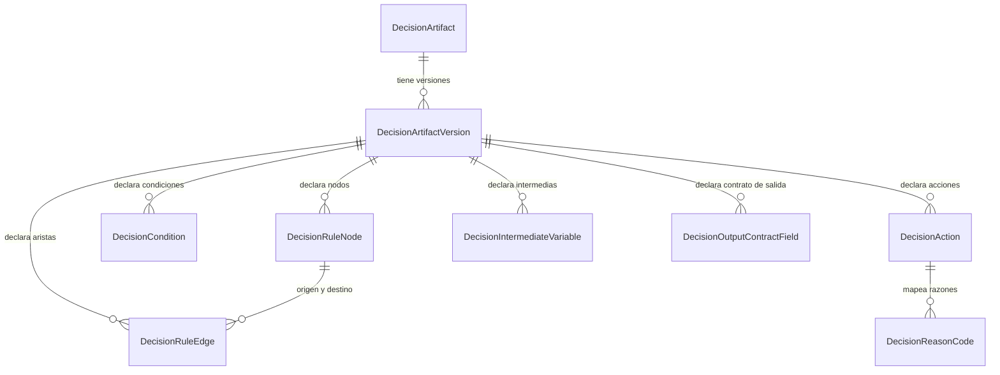
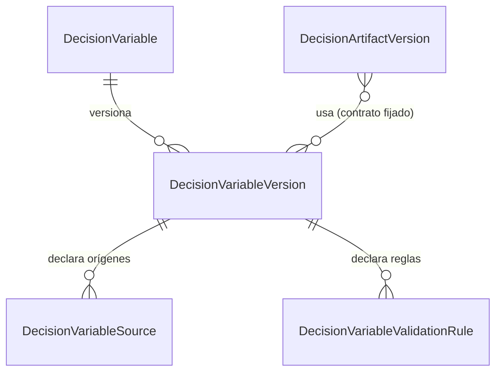
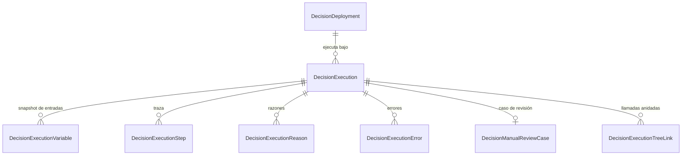

# Relaciones entre entidades

Cardinalidades y reglas de borrado. El detalle campo a campo está en el
[catálogo de entidades](entity-catalog.md), generado del esquema.

## Diseño de un algoritmo

## Catálogo de variables

Una versión de variable es inmutable. El artefacto **fija** la versión que usa, así que
publicar una versión nueva no altera los artefactos ya compilados.

## Ejecución y evidencia

!!! note "Las llamadas anidadas no crean ejecuciones hijas"
    Un artefacto que invoca a otro se resuelve **en memoria** durante la ejecución raíz. Las
    filas de `DecisionExecutionTreeLink` comparten la ejecución raíz y reconstruyen el árbol con
    `sequence` y `parentSequence`. Crear una ejecución por salto multiplicaría la evidencia y
    haría que una cadena de 25 saltos pareciera 25 decisiones.

## Reglas de borrado

| Relación | Regla | Por qué |
| --- | --- | --- |
| Ejecución → sus satélites | `Cascade` | La evidencia carece de sentido sin su ejecución |
| Ejecución → despliegue, versión, ambiente | `Restrict` | Borrar un despliegue dejaría ejecuciones sin contexto: la evidencia dejaría de ser reproducible |
| Variable version → artefactos que la usan | `Restrict` | Impide dejar un artefacto compilado apuntando a un contrato inexistente |
| Auditoría | **sin borrado** | `DELETE` revocado para el rol de aplicación |

## Integridad más allá de las claves foráneas

Hay invariantes que ninguna clave foránea expresa y que se aplican en el servicio:

- Un nodo solo puede escribir la intermedia de la que es **productor** declarado.
- Una referencia a otro artefacto no puede formar un **ciclo**.
- Una versión referenciada en PROD debe estar fijada de forma exacta, no por rango.
- El autor de una versión no puede ser quien la aprueba.
