# Relaciones entre entidades

Cardinalidades y reglas de borrado de los 75 modelos del esquema, agrupados por el dominio al
que pertenecen — no por orden alfabético, que no dice nada sobre cómo se usan juntos. El detalle
campo a campo de cada uno está en el [catálogo de entidades](entity-catalog.md), generado del
esquema; esta página documenta cómo se **relacionan**.

!!! warning "Nombres de modelo, no nombres de tabla"
    Los diagramas usan el nombre del modelo Prisma (el que usa el código), no el nombre de la
    tabla (el que usa SQL). `DecisionRuleCondition` es la tabla `decision_rule_condition`; el
    mapeo completo está en el [catálogo de entidades](entity-catalog.md).

## 1. Diseño del algoritmo

Un artefacto es el contenedor estable; cada versión es una fotografía inmutable una vez
aprobada. `sourceVersionId` registra de qué versión se clonó, para poder recorrer el árbol de
derivación de un algoritmo sin necesidad de un campo de "historial" aparte.

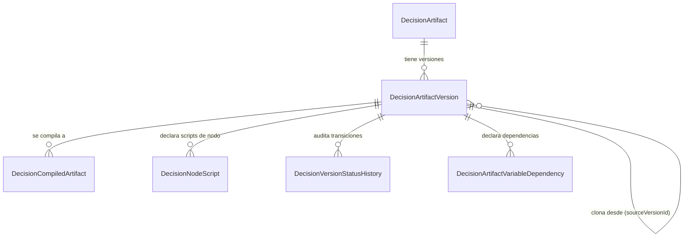

Solo `DRAFT` es editable; el resto del ciclo de vida está en
[flujos críticos](../business/critical-workflows.md).

## 2. Catálogo de variables

Una definición es el concepto de negocio (`variableCode`); cada versión fija su tipo,
restricciones y origen esperado. Una versión de variable es inmutable una vez publicada: un
artefacto la referencia por versión exacta a través de `DecisionArtifactVariableDependency`
(sección 1), no por la definición.

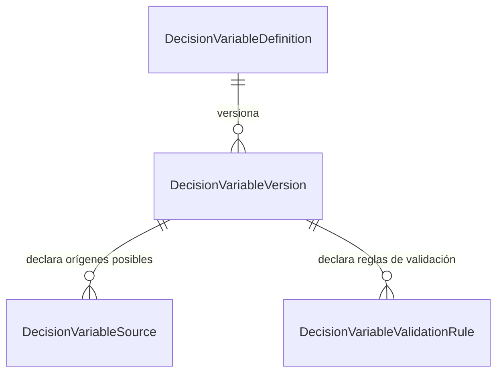

`DecisionVariableSource` puede tener varias filas por versión, ordenadas por `precedence`, con
como máximo una marcada `isAuthoritative`: así una variable puede tener un proveedor preferido y
alternativas de respaldo sin ambigüedad sobre cuál manda.

## 3. Grafo del artefacto: nodos, condiciones y acciones

El grafo de una versión son sus nodos y aristas; las condiciones y acciones son catálogos
**por versión**, reutilizables entre varios nodos o aristas a través de las tablas puente
`DecisionNodeCondition` / `DecisionEdgeCondition` / `DecisionNodeAction`. `DecisionReasonCode`,
en cambio, es un catálogo por tenant: la misma razón puede mapearse desde acciones de artefactos
distintos.

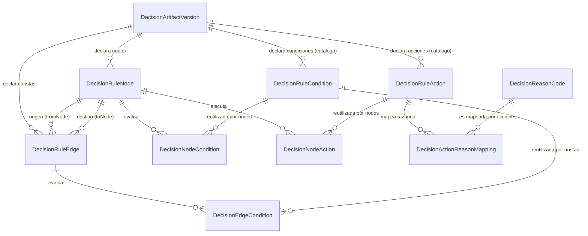

Una condición o acción `isReusable` puede evaluarse desde varios nodos del mismo grafo sin
duplicar su definición; el orden de evaluación por nodo vive en la tabla puente
(`evaluationOrder` / `executionOrder`), no en la condición o acción misma.

## 4. Variables intermedias

Una intermedia existe **solo dentro de la ejecución** de la versión que la declara. No cuelga
del catálogo global de variables (sección 2) a propósito: reutilizarla entre ejecuciones
rompería el aislamiento que el contrato exige (`docs/variable-contracts.md` §2).

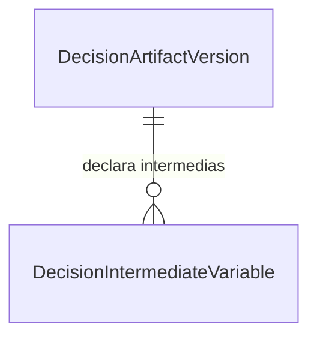

Su unicidad es `(artifactVersionId, code)`, no `(tenant, code)`: dos versiones de artefactos
distintos pueden reutilizar el mismo código sin colisión. `producerNodeKey` y
`consumerNodeKeys` no son claves foráneas — se validan por dominancia contra el grafo en
`validators/graph-intermediate.validator.ts`, porque en el momento de guardar el grafo los nodos
todavía no tienen fila propia estable a la que apuntar.

## 5. Contrato de salida

El contrato de salida de una versión es explícito: no se infiere del último nodo alcanzado.
`sourceKind` decide cómo se interpreta `sourceRef` (nodo productor, expresión, intermedia,
constante o artefacto referenciado).

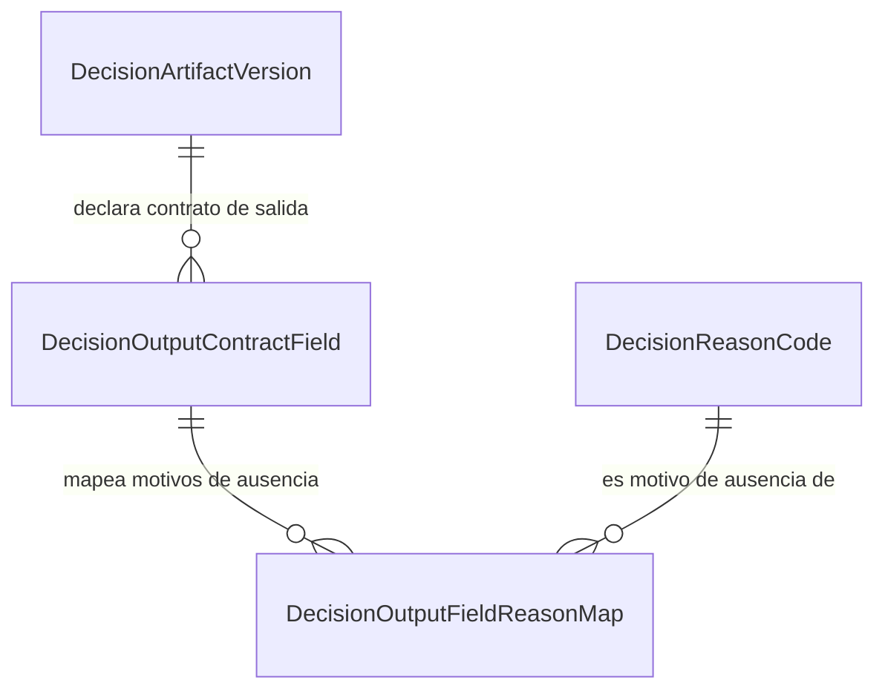

La correspondencia 1:1 entre un campo de salida y su dependencia de variable
`OUTPUT`/`OUTPUT_PRIMARY` (sección 2) se valida antes de publicar — dos fuentes de verdad para
el mismo dato serían exactamente el tipo de contradicción que rompe la reproducibilidad.

## 6. Campos calculados y librerías

Un campo calculado es una definición reutilizable, versionada igual que un artefacto: la
definición es el concepto, la versión fija la implementación (operación visual o código de
hasta tres líneas ejecutables). Un artefacto no incrusta el cálculo en el nodo: lo referencia
por versión, y `definitionJson` congela una copia para que el motor no vuelva a consultar la
base en tiempo de ejecución.

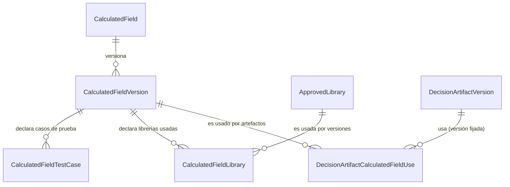

`CalculatedFieldLibrary` es la tabla puente de una relación muchos-a-muchos: una versión puede
habilitar varias librerías aprobadas, y la misma librería puede estar habilitada en muchas
versiones. Ninguna fila de `ApprovedLibrary` aporta código: solo **habilita** un preludio ya
presente en `library-preludes.ts` (`CLAUDE.md` §Campos calculados).

## 7. QA Lab

Una corrida genera casos a partir de una semilla; un contraejemplo se archiva **reducido** al
mínimo que sigue fallando, junto con la semilla y la ruta de `fast-check` que lo reproduce
exactamente.

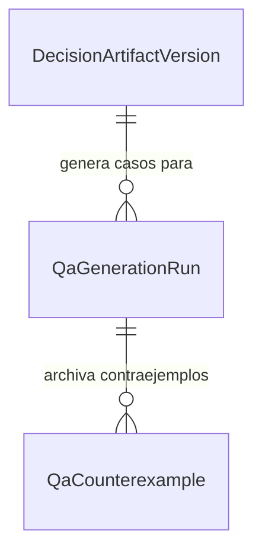

PROD queda excluido del QA Lab por diseño (`docs/business/critical-workflows.md` §3): no hay
relación posible hacia un despliegue de producción porque la corrida nunca se dirige ahí.

## 8. Gobierno y aprobaciones

Una solicitud de aprobación tiene pasos ordenados; cada paso exige un rol y un mínimo de
aprobaciones, con segregación de funciones activada por defecto (`separationOfDuties`). Cada
decisión de un paso puede adjuntar evidencia.

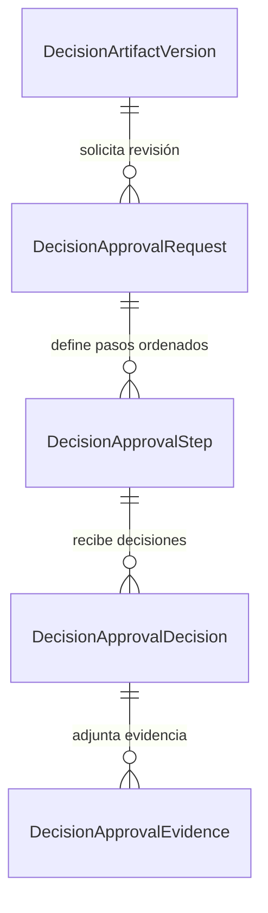

La regla que ninguna clave foránea expresa: **el autor de una versión no puede decidir sobre su
propia solicitud** — se aplica en `governance.service.ts`, no en el esquema.

## 9. Objetivos de negocio y política

Traza un objetivo de negocio hasta las versiones de artefacto y las suites de prueba que lo
sostienen — la matriz de [trazabilidad de gobierno](../governance/traceability-matrix.md) se
construye a partir de estas tres tablas puente.

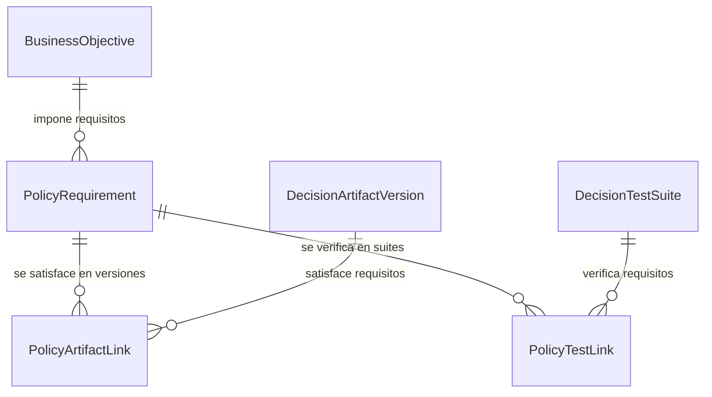

## 10. Pruebas

Una suite pertenece a una versión; sus casos son fijos, pero se ejecutan repetidamente contra
distintos artefactos **compilados** (no contra la versión en abstracto), lo que hace a
`DecisionTestRun` el punto donde se decide qué se compiló y qué salió.

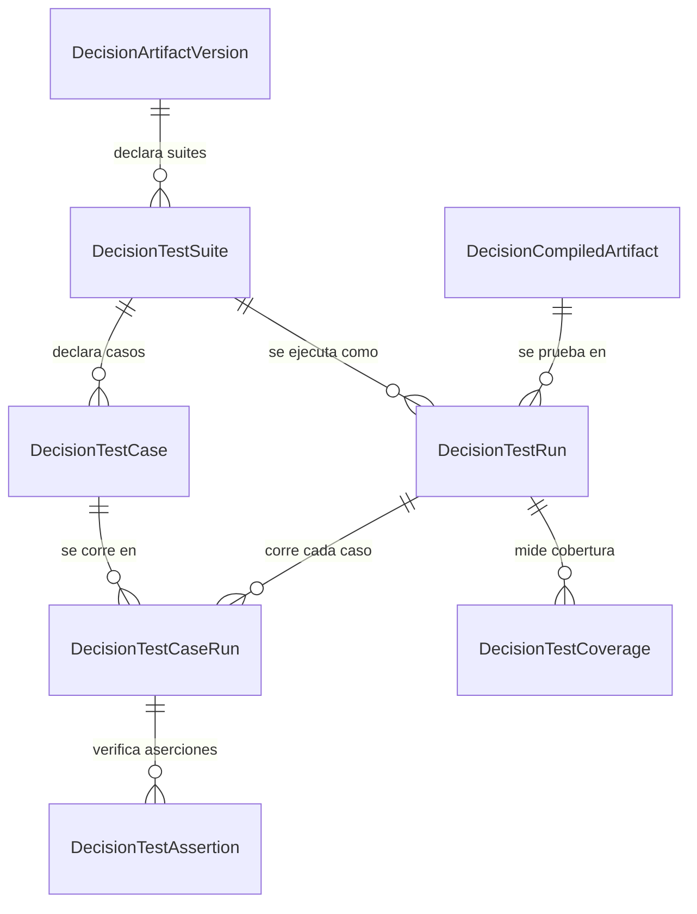

## 11. Despliegue y runtime

Un despliegue fija una versión, su artefacto compilado y un ambiente. `previousDeploymentId` y
`rollbackOfDeploymentId` son auto-relaciones opcionales que reconstruyen el historial de
despliegues y qué revirtió a qué, sin necesitar una tabla de historial aparte.

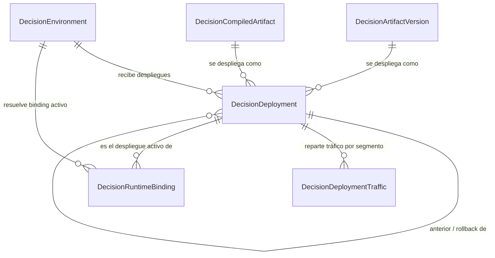

`DecisionRuntimeBinding` es la fila que el runtime lee en caliente para saber, dado
`(tenant, artifactCode, environment)`, qué despliegue está activo — evita recorrer el historial
completo de despliegues en cada decisión.

## 12. Ejecución y evidencia

El corazón del sistema: cada decisión persiste su despliegue, su snapshot de variables, la ruta
recorrida, las razones y los errores en la **misma** transacción.

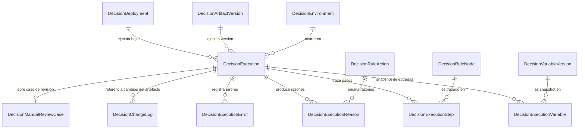

`RuntimeIdempotency` no aparece en el diagrama porque no tiene clave foránea hacia la ejecución:
guarda `(tenant, artifactCode, idempotencyKey) → responseJson` para poder responder un reintento
**antes** de saber si la ejecución llegó a persistirse. Es la tabla de mayor volumen de
escritura y la única con purga programada por TTL.

!!! note "Las llamadas anidadas no crean ejecuciones hijas"
    Un artefacto que invoca a otro (sección 13) se resuelve **en memoria** durante la ejecución
    raíz. Crear una `DecisionExecution` por salto multiplicaría la evidencia y haría que una
    cadena de 25 saltos pareciera 25 decisiones en vez de una.

## 13. Árboles anidados y código importado

Estas tres tablas declaran **sin relación Prisma**, a propósito: el bloque se mantiene
puramente aditivo y las claves foráneas reales, junto con sus políticas RLS, viven en el SQL de
la migración en vez de en el cliente generado. El diagrama muestra la relación **lógica** real,
no una que el ORM conozca.

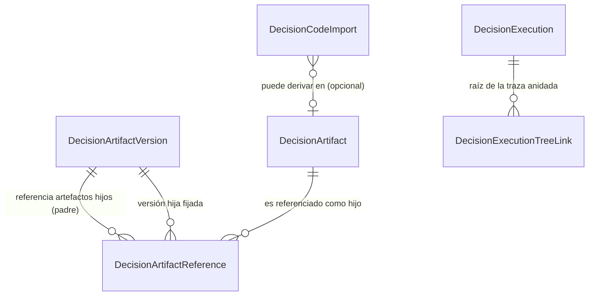

`DecisionExecutionTreeLink` reconstruye el árbol de llamadas de una ejecución raíz con
`sequence`/`parentSequence`; `childExecutionId` casi siempre es nulo porque la llamada anidada
corrió en memoria y nunca tuvo su propia fila de ejecución. `DecisionArtifactReference` fija la
**versión exacta** del hijo (`versionSelection = EXACT` es obligatorio de facto en PROD): es lo
que hace reproducible a un artefacto que compone a otros.

## 14. Auditoría y acceso

`DecisionAuditEvent` y `DecisionAccessAudit` no declaran ninguna relación, ni siquiera lógica, a
propósito: la cadena de auditoría no puede depender de la integridad referencial de lo que
describe, porque entonces borrar el agregado auditado —algo que en este dominio ya está
prohibido— además rompería la evidencia. `aggregateType` + `aggregateId` son una referencia
débil, de solo lectura, resuelta por convención.

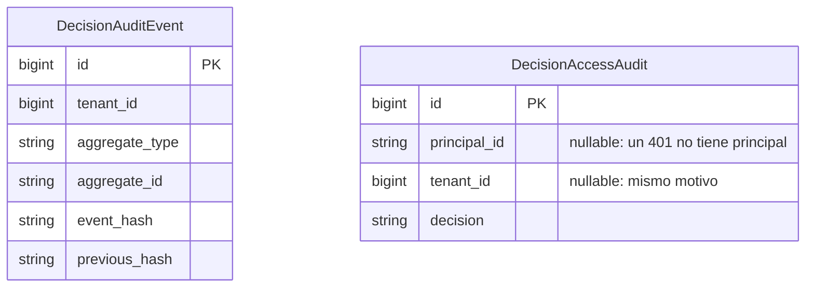

`previousHash` encadena cada evento con el anterior del mismo tenant; verificar la cadena es
`GET /v1/audit/chain/verify`, no una consulta a otra tabla.

## 15. Eventos y notificaciones

El outbox transaccional: una mutación de negocio escribe su evento en la **misma** transacción
que el cambio, así que "la base cambió pero el evento nunca se publicó" no puede ocurrir. Un
relay reclama filas `PENDING` con lease corto y las despacha; `ProcessedEvent` da idempotencia
por consumidor.

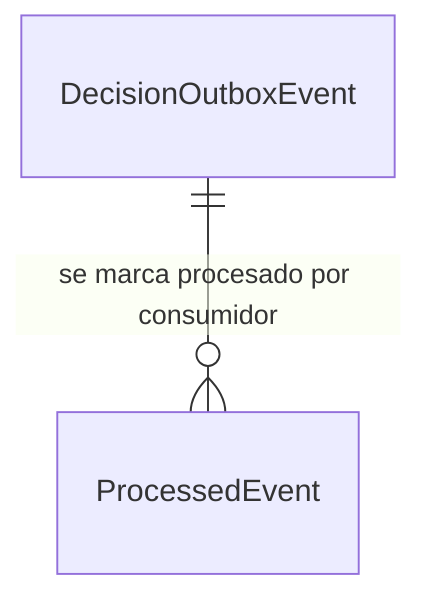

`Notification` no tiene clave foránea hacia el outbox: se proyecta de un evento consumido, pero
vive independiente porque su ciclo de vida (leída/no leída) no es el del evento que la originó.
Se dirige por rol y tenant, nunca por usuario: los usuarios viven en el proveedor de identidad
externo, no en esta base.

## 16. Identidad de integración

Un cliente de integración (API key) tiene credenciales, alcances (`scope`) y accesos a tenant
explícitos. Ninguna cabecera declara su propia identidad: todo se resuelve por el secreto
presentado, buscado por hash.

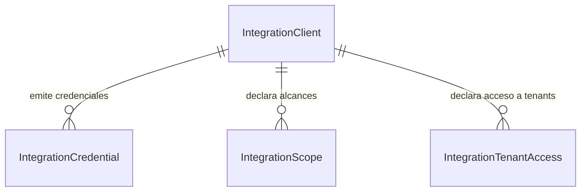

## 17. Workers adicionales y catálogo semántico

Cada worker tiene su propia tabla de ejecución (no una tabla genérica de trabajos): sus entradas
y resultados no se parecen en nada, y una tabla común habría dejado la mitad de las columnas
nulas. El catálogo semántico es **datos**, no código: añadir una categoría no exige desplegar.

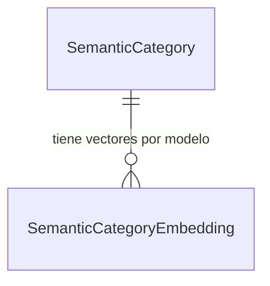

`SemanticAnalysisRun`, `BankStatementRun`, `SemanticEntityAlias` y `SemanticTenantBudget` no
tienen relación hacia el resto del esquema: son el límite del worker absorbido
([ADR-0026](../adr/ADR-0026-additional-workers-integration.md)), correlacionados con el resto
del sistema por `correlationId`, no por clave foránea.

## 18. Tutoriales

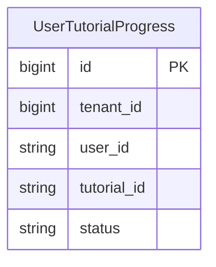

Sin relaciones: el progreso se identifica por `(tenant, usuario, tutorial)`, y el contenido
pedagógico vive en el frontend, no en esta tabla (`docs/tutorials.md`).

## Reglas de borrado

| Patrón | Regla | Dónde aparece | Por qué |
| --- | --- | --- | --- |
| Dentro de un agregado (versión → sus nodos, ejecución → sus satélites, aprobación → sus pasos) | `Cascade` | Secciones 1, 3, 8, 10, 12 | El hijo carece de sentido sin el padre que lo declaró |
| Entre agregados que se referencian por versión fijada (ejecución → despliegue/versión/ambiente, test run → artefacto compilado, uso de campo calculado → versión) | `Restrict` | Secciones 6, 10, 11, 12 | Borrar dejaría evidencia o un artefacto compilado apuntando a un contrato inexistente |
| Historial opcional (versión anterior de un despliegue, versión origen de un artefacto) | `SetNull` | Secciones 1, 11 | El historial se degrada, no desaparece, si su ancla se borra |
| Auditoría (`DecisionAuditEvent`) | **Sin borrado** | Sección 14 | `DELETE` revocado para el rol de aplicación; además es append-only por diseño |
| Nested trees / código importado | Sin FK en Prisma; FK real + RLS en el SQL de la migración | Sección 13 | Mantiene el bloque de modelos aditivo (`schema.prisma`, comentario de sección) |

## Integridad más allá de las claves foráneas

Invariantes que ninguna clave foránea expresa y que se aplican en el servicio, no en el esquema:

- Un nodo solo puede escribir la intermedia de la que es **productor** declarado
  (`producer_node_key`).
- Una referencia a otro artefacto (sección 13) no puede formar un **ciclo**.
- Una versión referenciada en PROD debe estar fijada de forma exacta, no por rango
  (`versionSelection = EXACT`).
- El autor de una versión no puede ser quien la aprueba (sección 8).
- Un campo del contrato de salida debe corresponder 1:1 con su dependencia de variable
  `OUTPUT`/`OUTPUT_PRIMARY` (sección 5).
- Toda tabla con `tenant_id` tiene su política RLS espejo en el SQL de la migración
  (`.claude/rules/80-database.md`); el esquema de Prisma no la expresa por sí solo.
