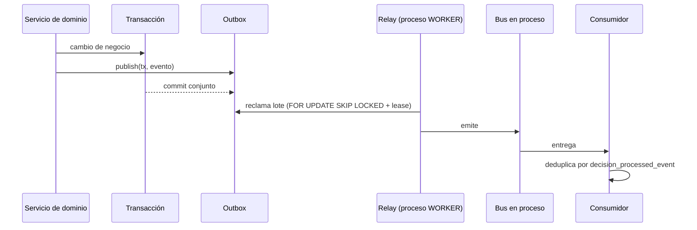

# Eventos de dominio — panorama

## Por qué hay un outbox

Un cambio de negocio y su notificación deben ser **el mismo hecho**. Si el evento se publicara
después de confirmar la transacción, un fallo entre ambos dejaría un cambio sin notificar; si
se publicara antes, un rollback dejaría una notificación de algo que nunca ocurrió.

La solución: el evento se **escribe en la misma transacción** que el cambio, en una tabla de
salida (*outbox*), y un relay lo despacha después.

## Piezas

| Pieza | Fichero | Responsabilidad |
| --- | --- | --- |
| Catálogo de tipos | `common/events/event-types.ts` | Fuente única de nombres y payloads v1 |
| Sobre | `common/events/event-envelope.ts` | Tenant, tipo, versión de esquema, agregado, actor, correlación |
| Publicador | `common/events/outbox-publisher.service.ts` | `publish(tx, envelope)` dentro de la transacción del negocio |
| Relay | `modules/outbox-relay/` | Reclamo con lease, retroceso exponencial, cola muerta |
| Bus | `common/events/event-bus.ts` | Entrega en proceso |
| Proyector | `modules/notifications/notification-projector.service.ts` | Consumidor idempotente que alimenta la bandeja |

El catálogo con productores y consumidores reales se genera del código:
[catálogo de eventos](event-catalog.md).

## Alcance actual

- **Bus en proceso**, sin broker externo. Un broker resolvería un problema que este sistema aún no tiene y añadiría un modo de fallo más. El outbox es la pieza que permitiría cambiarlo sin tocar a los productores.
- El relay es **cross-tenant por diseño**: drena la tabla completa. Una prueba que cuente eventos globales debe usar `>=`, no `==`.
- Los eventos **no** son parte del contrato público hoy: no hay suscriptores externos. `asyncapi/asyncapi.yaml` documenta el contrato interno para cuando los haya.

## Versionado de payloads

Romper la forma de un payload significa **subir `schemaVersion` en el sobre**, nunca mutar el
tipo existente: hay eventos ya procesados con la forma anterior y la auditoría los conserva.

Ver [semántica de entrega](delivery-semantics.md) y
[reintentos y cola muerta](retries-and-dlq.md).
