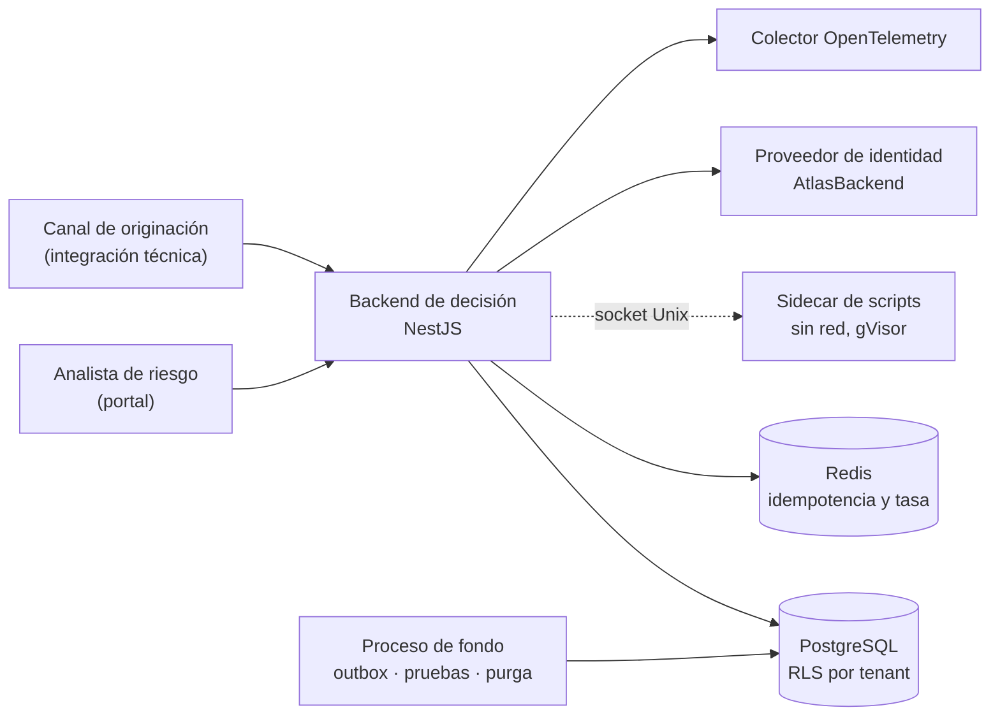

# ATLAS Decision Platform — Backend

Motor de decisión **gobernado** para crédito, riesgo y fraude. Un analista diseña un
algoritmo en un editor visual; la plataforma lo valida, lo compila a un artefacto inmutable,
lo somete a aprobaciones con segregación de funciones, lo despliega por ambiente y luego
ejecuta cada decisión dejando evidencia reproducible y auditable.

!!! info "Qué hace distinto a este backend"
    No es un servicio que "calcula un score". Es un sistema de **gobierno**: la decisión que
    tomó ayer se puede reproducir hoy con el mismo artefacto, las mismas variables y el mismo
    resultado, y se puede demostrar quién la autorizó.

## Capacidades principales

| Capacidad | Dónde empezar |
| --- | --- |
| Catálogo de variables con contrato, restricciones y ejemplos | [Contexto de negocio](business/business-context.md) · [Variables](modules/variables.md) |
| Diseño y compilación de algoritmos de decisión | [Ciclo de vida de una petición](architecture/request-lifecycle.md) |
| Ejecución en línea idempotente con evidencia | [Idempotencia](api/idempotency.md) · [Runtime](modules/runtime.md) |
| Gobierno, aprobaciones y segregación de funciones | [Flujos críticos](business/critical-workflows.md) |
| Pruebas deterministas y generación masiva guiada por contrato | [Estrategia de pruebas](testing/strategy.md) |
| Auditoría encadenada por hash, append-only | [Auditabilidad](security/auditability.md) |

## Contexto en una imagen



## Enlaces rápidos

<div class="grid cards" markdown>

- :material-rocket-launch: **Levantar el entorno local**
  → [Entorno local](getting-started/local-setup.md)

- :material-api: **Consumir la API**
  → [Convenciones](api/conventions.md) · [Catálogo de endpoints](api/endpoint-catalog.md)
  → Referencia interactiva: `/docs/{API_VERSION}/reference` del backend

- :material-server: **Desplegar**
  → [Despliegue](operations/deployment.md) · [Escalado](operations/scaling.md)

- :material-alert: **Responder a un incidente**
  → [Runbooks](runbooks/README.md) · [Respuesta a incidentes](security/incident-response.md)

</div>

## Cómo está construida esta documentación

Buena parte de estas páginas **no se escribe a mano**: se genera del código y falla si se
desactualiza. El catálogo de endpoints sale del contrato OpenAPI, que a su vez sale de los
controladores reales; el de entidades, del esquema de Prisma; el de errores, de las
excepciones que el código lanza; el de variables de entorno, del esquema de validación.

```bash
yarn docs:openapi:generate   # contrato desde la aplicación real
yarn docs:validate           # contrato + catálogos + cobertura + enlaces
yarn docs:build              # portal en contenedor, modo estricto
```

Ver [política de documentación](governance/documentation-policy.md) y
[ADR-0023](adr/ADR-0023-generated-documentation.md).

## Propiedad y versión

| | |
| --- | --- |
| Equipo responsable | Plataforma ATLAS |
| Versión del contrato de API | `v1` (`API_VERSION`) |
| Versión del build | `BUILD_VERSION`, publicada en `/health/live` |
| Stack | NestJS 11 · Prisma 6 · PostgreSQL · Redis · Jest |

Los propietarios por área están en [gobierno / propiedad](governance/ownership.md).
