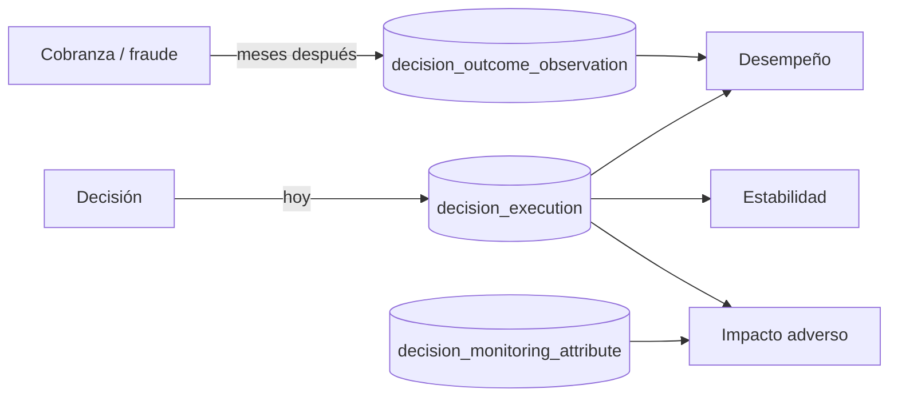

# Monitoreo continuo del modelo

## El lazo que faltaba

Hasta ahora el motor sabía qué había decidido y **nadie le contaba nunca si acertó**. Un
artefacto aprobado y desplegado seguía atendiendo tráfico indefinidamente sin que existiera un
dato que dijera si seguía funcionando. Eso es exactamente lo que SR 11-7 §V llama *ongoing
monitoring* y CMN 4.557 art. 40 exige como seguimiento del riesgo de modelo.

Cerrar el lazo requiere una pieza que no estaba: **capturar el resultado real**, que llega
meses después de la decisión y por un sistema distinto —cobranza, confirmación de fraude—.

## Tres preguntas, tres análisis

Se responden por separado porque **se degradan por separado**: un modelo puede seguir
acertando sobre quien evalúa y estar viendo una población distinta de aquella con la que se
construyó.

### ¿Sigue acertando? — `POST /v1/model-monitoring/performance`

| Medida | Qué dice |
| --- | --- |
| `badRate` | Aprobaciones que salieron mal |
| `falseDeclineRate` | Rechazos que se habrían comportado bien |
| `discrimination` | Separación entre la puntuación media de buenos y malos (0 a 1) |

!!! important "«No se sabe» no cuenta como acierto"
    `INDETERMINATE` se cuenta como observado pero **no entra en ningún denominador**. Mezclar
    «no se sabe» con «salió bien» es la forma más silenciosa de inflar el desempeño: 2 buenos,
    1 malo y 7 sin desenlace darían 10 % de malos con un denominador ingenuo, cuando la cifra
    real es 33 %.

`falseDeclineRate` es la mitad del análisis que casi nadie mide, y la que detecta un modelo que
se ha vuelto demasiado restrictivo: sus malos no aparecen porque nunca llegaron a entrar.

!!! warning "`discrimination` no es KS ni AUC"
    Es una medida barata y estable con pocos casos, que es la situación real de una ventana de
    monitoreo. Sirve para ver una **tendencia** —si cae mes a mes, el modelo se degrada—, no
    para publicarla como poder discriminante.

### ¿Le siguen llegando los mismos solicitantes? — `POST /v1/model-monitoring/stability`

Índice de estabilidad poblacional entre una ventana de referencia y la actual:

`PSI = Σ (actual − referencia) · ln(actual / referencia)`

| PSI | Veredicto |
| --- | --- |
| < 0.10 | `STABLE` |
| 0.10 – 0.25 | `SHIFTED` |
| ≥ 0.25 | `UNSTABLE` |

Las categorías ausentes en una ventana usan un piso mínimo en vez de cero: `ln(0)` es infinito
y **un solo valor nuevo llevaría el índice al infinito**, que no es información sino un fallo de
cálculo.

!!! note "Limitación con variables sensibles"
    Un valor sensible se persiste como HMAC, así que solo aporta su presencia como categoría
    opaca: se detecta si cambia el reparto de valores distintos, no su magnitud. Es una
    limitación real, y preferible a guardar el valor.

### ¿Trata igual a grupos comparables? — `POST /v1/model-monitoring/adverse-impact`

Razón de impacto adverso por grupo: tasa de aprobación del grupo dividida por la del grupo de
mayor tasa. Por debajo de **0.8** —la regla de los 4/5— hay indicio que exige explicación.

Los grupos con menos de **30 casos** se excluyen del veredicto y se listan aparte: tres
personas producen razones extremas que son ruido, y señalarlas enseña a ignorar el informe.

!!! danger "Qué NO es este resultado"
    **No es una conclusión de discriminación.** Una razón baja puede tener explicación legítima
    de negocio; lo que obliga es a buscarla y documentarla. Y **no sustituye el análisis del
    regulador**: es un tamiz para detectar pronto lo que después se estudia en serio.

## La tensión del atributo demográfico

Para comprobar que un modelo no discrimina hay que saber a qué grupo pertenece cada
solicitante, y ese es justamente el dato que **ECOA §1002.6(b)(9) prohíbe usar al decidir** —y
que el [validador de licitud de uso](security/regulatory-controls.md) rechaza en un contrato de
entrada.

La salida no es renunciar a medir: un modelo que nadie audita por sesgo es peor. Es **separar
los caminos de forma que no puedan tocarse**:

| | Variable de decisión | Atributo de monitoreo |
| --- | --- | --- |
| Dónde vive | Catálogo de variables | `decision_monitoring_attribute` |
| Cuándo se escribe | Antes de decidir | **Después** de decidir |
| Quién lo escribe | El solicitante de la decisión | Rol `COMPLIANCE`, por su propio endpoint |
| ¿Lo lee el motor? | Sí | **Nunca** |
| ¿Puede entrar en un contrato? | Sí | No: no cuelga del catálogo |

Es el mismo criterio con el que Regulation B admite el autoexamen: **recoger el dato para
comprobarse a uno mismo no es usarlo para decidir**.

Se guarda el grupo ya agrupado —bandas, no valores exactos—: para medir sesgo basta el grupo, y
el dato exacto sería retener más de lo necesario.

## Qué se registra

| Endpoint | Rol | Para qué |
| --- | --- | --- |
| `POST /outcomes` | `OPERATIONS`, `RISK_ANALYST`, `COMPLIANCE` | Desenlace real; lo carga el sistema de cobranza |
| `POST /attributes` | **solo** `COMPLIANCE` | Grupo demográfico, solo para medir sesgo |

La unicidad de un desenlace es **(ejecución, ventana)**: el mismo caso se observa a 30, 90 y 180
días porque el comportamiento de un crédito depende del plazo, pero no dos veces la misma
ventana. Se hace `upsert` porque la evidencia se corrige —un impago que después se regulariza—,
y obligar a borrar para corregir dejaría abierto el borrado sin más.

## Métricas

| Métrica | Qué vigilar |
| --- | --- |
| `atlas_model_observed_outcomes_total` | **Si deja de crecer, el lazo está muerto** y todo lo demás describe una foto vieja |
| `atlas_model_bad_rate` | Tendencia por versión |
| `atlas_model_population_stability_index` | ≥ 0.25 exige revisión |
| `atlas_model_adverse_impact_ratio` | < 0.8 exige explicación documentada |

## Comparar dos versiones

No hay un endpoint de campeón/aspirante porque no hace falta: el reparto de tráfico ya existe
en el despliegue, y `performance` se pide **por versión**. Dos llamadas sobre la misma ventana
comparan las dos ramas con la misma medida.

## Lo que sigue sin cubrirse

- **Reentrenamiento automático.** Deliberado: en un motor de decisión gobernado, un modelo
  nuevo pasa por la puerta de aprobación como cualquier otro cambio.
- **Alertas sobre estos umbrales.** Las métricas están publicadas; las reglas de alerta viven
  en el sistema de observabilidad, no aquí. Ver [alertas](observability/alerts.md).
