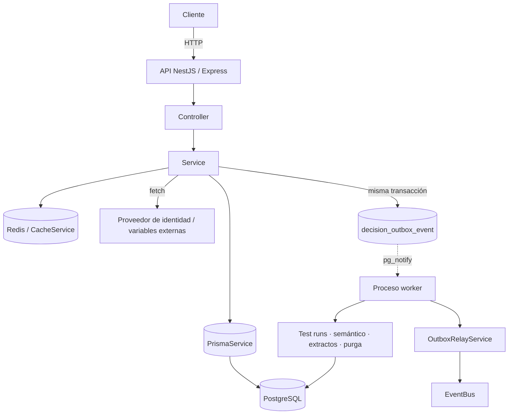

# Fase 0 — Auditoría del estado actual

Inspección del repositorio **antes** de tocar una línea de código. El objetivo es no
reimplementar lo que ya existe y no romper lo que ya funciona.

## Conclusión en una frase

El motor **ya arranca OpenTelemetry correctamente** (bootstrap temprano, OTLP/HTTP, cierre
limpio) y **ya tiene una capa de trazado de calidad** —`TracingService`,
`MessagingTraceService`, `TraceContextService`— pero esa capa está **encerrada dentro del
worker de análisis semántico** absorbido por ADR-0026, y el resto del backend no puede usarla.
El trabajo no es instalar Jaeger: es **generalizar lo que ya hay** y cerrar los huecos reales.

## 1. Arquitectura detectada

| Elemento | Valor real | Fuente |
| --- | --- | --- |
| Framework | NestJS 11 | `package.json` |
| Adaptador HTTP | **Express** (`@nestjs/platform-express`) | `package.json`, `main.ts` |
| ORM | **Prisma 6** con `@prisma/adapter-pg` — **no Sequelize** | `prisma.service.ts` |
| Driver PostgreSQL | `pg` 8 (`Pool` explícito) | `prisma.service.ts:38` |
| Cliente Redis | `ioredis` 5 | `package.json` |
| HTTP saliente | **`fetch` global (undici)** — no Axios, no `HttpModule` | `identity-provider.client.ts`, `jwt-verifier.service.ts`, `variable-resolution.service.ts` |
| Logs | **Pino 10** detrás de `StructuredLoggerService` (instalado con `app.useLogger`) | `structured-logger.service.ts` |
| Métricas | `prom-client` vía `MetricsService` | `metrics.service.ts` |
| Colas | **No hay BullMQ ni pg-boss.** Outbox transaccional en PostgreSQL + orquestador propio | `job-scheduler.service.ts`, `outbox-relay.service.ts` |
| Cron | No hay `@nestjs/schedule`. Trabajos periódicos con retroceso adaptativo en `JobSchedulerService` | `job-scheduler.service.ts` |
| WebSockets | No. Hay SSE para ejecución en vivo | `live-execution/` |
| Configuración | `ConfigService` + validación zod en `env.schema.ts` | `env.schema.ts` |
| Gestor de paquetes | **Yarn 1.22** (`yarn.lock`) | — |
| Node del entorno | v24.18.1 | `node -v` |

> **Corrección explícita al enunciado del encargo:** el briefing asumía Sequelize, Axios y
> Bull/BullMQ. Ninguno de los tres existe en este repositorio. Se instrumenta lo que hay
> (Prisma sobre `pg`, `fetch`/undici, outbox propio) y no se instala nada para cubrir
> tecnologías ausentes.

### Procesos ejecutables

Son **dos**, y arrancan por separado:

| Proceso | Entrada | Qué es | Sondas |
| --- | --- | --- | --- |
| API | `src/main.ts` | `NestFactory.create` con Express, controladores de negocio | `/health`, `/metrics` en el puerto HTTP |
| Worker | `src/worker.ts` | `NestFactory.createApplicationContext` — **mismo `AppModule`**, sin adaptador HTTP | servidor `node:http` mínimo en `WORKER_HEALTH_PORT` |

Qué corre en cada uno lo decide `WORKER_ROLE` (`common/config/worker-role.ts`), consultado por
cada servicio de fondo en su propio `onModuleInit`. En Compose: `api` con `WORKER_ROLE=API`,
`worker` con `WORKER_ROLE=WORKER`.

Hay además procesos de un solo disparo (`migrate`, `seed`, `bootstrap-app-role`, `smoke`) que
hoy no emiten trazas y que **no** conviene instrumentar: su valor diagnóstico es su código de
salida, no una traza.

### Flujo actual

El salto **API → worker** es el punto donde hoy se pierde toda correlación: el trabajo viaja
como **fila en PostgreSQL**, no como mensaje con cabeceras, y el contexto de OpenTelemetry vive
en `AsyncLocalStorage`, que no sobrevive al proceso.

## 2. Lo que YA existe (y no se debe reinventar)

- `src/common/observability/tracing.ts` — `NodeSDK` arrancado **antes** de todo import de Nest
  en `main.ts:8` y `worker.ts:29`. Instrumenta `http`, `express`, `pg`, `ioredis`. Excluye
  `/health*`, `/ready`, `/metrics`. `enhancedDatabaseReporting: false` (no captura valores de
  parámetros SQL). Cierre explícito en `SIGINT`/`SIGTERM`, tolerante a fallo.
- `.claude/rules/40-observability.md` lo declara expresamente: *«Trazas OpenTelemetry ya
  instrumentadas; no reinventes el bootstrap de OTel»*.
- **Capa de trazado completa** en `src/modules/workers/semantic-analysis/core/observability/`:
  `TracingService` (`runInSpan`/`runInSpanWith`/`runInRootSpan`), `MessagingTraceService`
  (inject/extract W3C con portador `_otel`), `TraceContextService`, `TraceCorrelationLogger`,
  `recordSpanError`. Código de buena calidad, documentado y con las decisiones correctas.
- `RequestContextService` (AsyncLocalStorage) con `requestId` propagado y cabecera
  `x-request-id` de ida y vuelta.
- Redacción agresiva de PII en `StructuredLoggerService` (`SENSITIVE_KEYS`), que ya cubre
  `variables`, `input`, `payload`, `context`… con sobre-redacción deliberada.

## 3. Huecos reales (esto es el trabajo)

| # | Hueco | Impacto | Fase |
| --- | --- | --- | --- |
| H1 | La capa de trazado sólo la ve `WorkersModule`; `TracingService` es su único proveedor registrado. `MessagingTraceService` y `TraceContextService` **no están registrados en ningún módulo** | Ningún dominio del motor puede crear un span sin importar desde dentro de un worker | 5 |
| H2 | `recordSpanError` depende de `semantic-analysis.errors` | No es reutilizable fuera de ese worker | 5 |
| H3 | Los logs Pino **no llevan `trace_id`** | No se puede saltar de un log a Jaeger | 6 |
| H4 | No existe la cabecera `x-trace-id` en las respuestas | Soporte técnico no tiene identificador que pedir | 6 |
| H5 | `DomainExceptionFilter` no marca el span activo | Un 500 no aparece como error en la traza | 7 |
| H6 | **`fetch` global no está instrumentado**: `instrumentation-http` no parchea undici | Las llamadas al proveedor de identidad y a variables externas **no aparecen** y no propagan `traceparent` | 2, 11 |
| H7 | El contexto **no cruza** hacia el worker (outbox ni ejecuciones encoladas) | La traza muere en el commit | 12 |
| H8 | `JobSchedulerService` ejecuta cada lote **sin span raíz** | El trabajo de fondo es invisible en Jaeger | 13 |
| H9 | Sin spans de negocio en el motor de decisión (`ExecutionEngineService`, `RuntimeService`) | La operación más importante del producto no se ve | 8 |
| H10 | Sin sampler, sin propagadores explícitos, sin `service.namespace`, sin timeout de exportación | No hay control de volumen ni de coste | 3, 17 |
| H11 | Sin Jaeger local, sin Collector, sin script de verificación | No se puede ver una traza sin montarlo a mano | 14, 15, 21 |
| H12 | **Cero pruebas** de observabilidad | Nada garantiza que siga funcionando | 19, 20, 21 |

## 4. Datos sensibles — dónde puede filtrarse

Este backend decide crédito, riesgo y fraude. El material sensible es real:

- **Variables de decisión** (`variables`, `input`, `payload`): ingresos, deudas, identificadores
  fiscales. Ya redactados en logs; **no deben entrar nunca en atributos de span**.
- **Texto analizado** por el worker semántico (`input_text`).
- **Extractos bancarios** (`file_bytes`, número de cuenta).
- Credenciales: `MANAGEMENT_API_KEY`, `RUNTIME_API_KEY`, `AUDIT_HASH_SECRET`, `METRICS_TOKEN`,
  cabecera `authorization`, cookie `atlas_refresh`.
- SQL: `enhancedDatabaseReporting` ya está desactivado; **debe seguir así**.

## 5. Endpoints a excluir

`/health`, `/health/live`, `/health/ready`, `/ready`, `/metrics`, `/favicon.ico`. Los cuatro
primeros ya están excluidos; se añaden los alias del enunciado (`/healthz`, `/readiness`,
`/liveness`) por si un orquestador los usa.

## 6. Riesgos identificados

| Riesgo | Mitigación |
| --- | --- |
| Mover la capa de trazado rompe el worker semántico recién fusionado | Los ficheros se **promueven** a `common/`, y el worker importa desde allí. `yarn typecheck` + suite completa como red |
| Añadir `instrumentation-undici` puede duplicar spans con `instrumentation-http` | undici no pasa por `http`; se verifica en la traza real |
| Una columna nueva para el portador de traza es una migración | Aditiva y anulable: las filas antiguas quedan `NULL` y `extract` ya tolera su ausencia |
| Muestreo al 100 % en producción | `parentbased_traceidratio` configurable; se documenta y se deja bajo por defecto en producción |
| Jaeger caído bloqueando peticiones | El exportador OTLP es asíncrono con reintento; se prueba explícitamente (Fase 20) |
| Los documentos nuevos rompen `mkdocs build --strict` | Se añaden a la navegación de `mkdocs.yml` |

## 7. Plan adaptado a este repositorio

1. **Generalizar, no duplicar**: promover la capa del worker semántico a
   `src/common/observability/tracing/` y registrarla en el `ObservabilityModule` global.
2. **Reescribir el bootstrap** conservando su firma (`startTracing`/`stopTracing`) para no
   tocar `main.ts` ni `worker.ts` más de lo necesario.
3. **Cerrar los huecos** H3–H9 en orden.
4. **Infraestructura y pruebas** al final, con evidencia ejecutada.

## 8. Ficheros que se modificarán

`src/common/observability/tracing.ts` · `observability.module.ts` ·
`structured-logger.service.ts` · `src/common/errors/domain-exception.filter.ts` ·
`src/common/config/env.schema.ts` · `src/common/jobs/job-scheduler.service.ts` ·
`src/common/events/outbox-publisher.service.ts` · `src/modules/outbox-relay/outbox-relay.service.ts` ·
`src/modules/runtime/runtime.service.ts` · `src/modules/workers/workers.module.ts` y los
ficheros del worker semántico que importan su capa local · `package.json` · `.env.example` ·
`docker-compose.yml` · `mkdocs.yml` · `prisma/schema.prisma` (columna aditiva).

## 9. Ficheros que NO deben modificarse

- `src/modules/workers/semantic-analysis/core/domain/**` y `core/application/**` — núcleo
  absorbido sin modificar (ADR-0026); sólo cambian sus **rutas de import**.
- La cadena de auditoría (`DecisionAuditEvent`) y `AuditService` — append-only.
- Migraciones existentes.
- `scripts/smoke.*`, `scripts/docs/**` — no relacionados.
- Cualquier lógica de decisión: los spans se añaden **envolviendo**, sin alterar el resultado.

## 10. Criterio de aceptación de esta fase

Cumplido: se conocen los dos puntos de arranque (`main.ts`, `worker.ts`), cómo se separan
(`WORKER_ROLE`), qué tecnologías existen realmente y cuáles del enunciado no existen.
