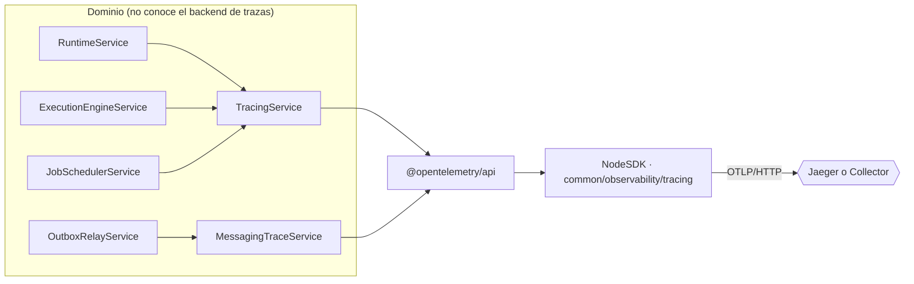
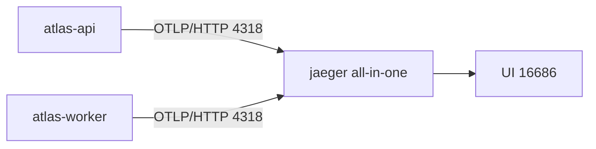
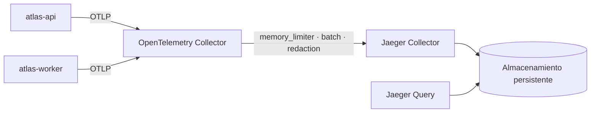
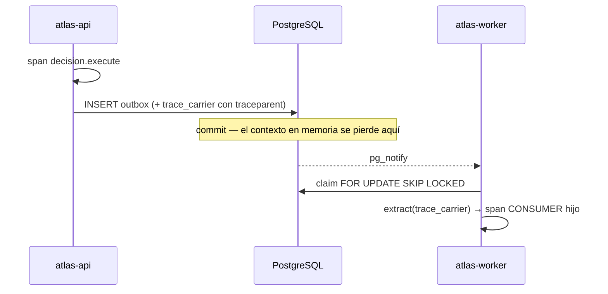

# Fase 1 — Diseño de la arquitectura de observabilidad

Decisiones tomadas sobre la arquitectura **real** descrita en
[la auditoría](00-current-state-audit.md). Cada una explica la alternativa descartada.

## Principio rector

El dominio no conoce Jaeger. Ni siquiera debería conocer OpenTelemetry más de lo
imprescindible: un servicio de negocio depende de `TracingService`, una fachada pequeña y
estable. Cambiar de backend de trazas —o retirarlas— no toca la lógica de decisión.



## Topología

### Desarrollo — directo a Jaeger



Un salto menos que mantener, y el `all-in-one` con almacenamiento en memoria es exactamente
lo que se quiere en local: se reinicia y queda limpio.

### Producción — a través del Collector



El Collector es la razón por la que la aplicación no depende de que Jaeger esté vivo: absorbe
la indisponibilidad, aplica la redacción como **última red** y permite cambiar de backend sin
redesplegar el motor. Detalle en [03-production-topology.md](03-production-topology.md).

## Decisiones

### Protocolo: OTLP **HTTP/protobuf**

El repositorio ya trae `@opentelemetry/exporter-trace-otlp-http` y funciona. gRPC arrastraría
`@grpc/grpc-js` para ganar un rendimiento de exportación que aquí no es el cuello de botella.
**Descartado gRPC** por coste de dependencia sin beneficio medible a este volumen.

### Nombres de servicio

Un nombre por proceso; reutilizar el de la API en el worker destruiría el grafo de
dependencias de Jaeger.

| Proceso | `OTEL_SERVICE_NAME` |
| --- | --- |
| `main.ts` | `atlas-api` |
| `worker.ts` | `atlas-worker` |

Se toman de `OTEL_SERVICE_NAME`; el valor por defecto lo aporta cada arranque, no una
constante compartida. Namespace común `atlas` (`OTEL_SERVICE_NAMESPACE`), versión desde
`BUILD_VERSION` y entorno desde `OTEL_DEPLOYMENT_ENVIRONMENT` (por defecto `NODE_ENV`).

> El worker semántico absorbido declara sus propios `SERVICE_NAMES`. Dentro de este motor
> **no aplica**: corre dentro del proceso `atlas-worker` y comparte su nombre de servicio.
> Se distingue por el atributo `app.module`, no por un servicio aparte.

### Muestreo: `parentbased_traceidratio`

Basado en el padre para respetar la decisión de servicios aguas arriba, con ratio configurable
por `OTEL_TRACES_SAMPLER_ARG`. Nunca fijo en el código. Valores en
[Fase 17](#fase-17--muestreo-valores-de-partida).

### Propagadores: `tracecontext,baggage`

W3C estándar. **B3 descartado**: no hay ningún consumidor heredado que lo exija; añadirlo sólo
aumentaría el tamaño de las cabeceras salientes.

### Convención de nombres de span

`<dominio>.<acción>`, estable y **sin identificadores**. Un `credit.evaluate.387471` crea una
serie temporal por ejecución y hace inútil cualquier agregación.

```
decision.execute      runtime.evaluate      outbox.publish
outbox.dispatch       job.run               semantic.consume
```

### Atributos

Namespace `app.*` para lo propio, convenciones semánticas para lo estándar.

| Permitido | Prohibido |
| --- | --- |
| `app.module`, `app.operation` | Valores de variables de decisión |
| `app.tenant.id`, `app.entity.type`, `app.entity.id` | Texto analizado, contenido de extractos |
| `app.job.name`, `app.job.attempt`, `app.event.type` | Cabeceras `authorization`, cookies, API keys |
| `db.system`, `db.operation.name`, `server.address` | Parámetros SQL, cuerpos de petición/respuesta |
| `decision.outcome` (cardinalidad acotada) | Documentos de identidad, datos bancarios |

`app.entity.id` es la única concesión a cardinalidad alta, y es deliberada: sin el
identificador de la ejecución no se puede ir de un incidente concreto a su traza. Es un
identificador **opaco** del motor, no un dato personal.

### Política de errores

Se registra la excepción **una sola vez**, en el span donde nace. El filtro global marca el
span activo y deja que el flujo siga: la observabilidad nunca convierte un fallo en un éxito
ni cambia un código HTTP. Los stack traces no salen al cliente (ya lo garantiza
`DomainExceptionFilter` en producción).

### Estrategia de cierre

El SDK vive **fuera** del ciclo de vida de Nest, así que `enableShutdownHooks` no lo vacía.
`stopTracing()` se invoca explícitamente en `SIGINT`/`SIGTERM` y nunca lanza: perder spans no
puede convertir un apagado limpio en una caída.

### Estrategia para workers y colas

Éste es el punto no trivial de este repositorio. **No hay broker**: el trabajo viaja como fila
en PostgreSQL. La propagación tiene que ser explícita y persistida.



- Al publicar: `propagation.inject` en una **columna nueva y anulable** `trace_carrier`.
  Alternativa descartada: meterlo dentro de `payload_json`, que es el contrato que ven los
  consumidores; contaminarlo con metadatos de transporte es un cambio de contrato encubierto.
- Al consumir: `propagation.extract`. Una fila sin portador —toda fila anterior a este
  cambio— devuelve el contexto activo y abre una traza raíz. **Compatibilidad hacia atrás por
  construcción**, no por una rama especial.
- Spans `PRODUCER` al publicar y `CONSUMER` al consumir.

### Estrategia para trabajos programados

`JobSchedulerService` abre un span **raíz** por lote (`root: true`): un trabajo periódico no
tiene origen y no debe heredar el contexto de lo que se estuviera ejecutando en el proceso. Un
span por **lote**, nunca uno por registro procesado.

### Estrategia para logs

Pino sigue siendo el sistema de logs; no se sustituye ni se duplica una sola línea. Se añaden
`trace_id`, `span_id` y `trace_flags` al registro **desde el contexto activo de
OpenTelemetry** — nunca desde una cabecera del cliente, que sería trivial de falsificar y no
correspondería a ninguna traza real.

### Estrategia para datos sensibles

Defensa en tres capas, porque una sola falla:

1. **En origen**: ningún span recibe payloads; los atributos permitidos están enumerados.
2. **En la instrumentación**: `enhancedDatabaseReporting: false`, cabeceras sensibles no
   capturadas, rutas de sonda excluidas.
3. **En el Collector**: procesador `attributes` que borra lo que se haya colado.

Detalle en [04-data-privacy-policy.md](04-data-privacy-policy.md).

## Estructura de ficheros

Se **promueve** la capa que ya existe dentro del worker semántico, en lugar de escribir una
segunda igual:

```
src/common/observability/
├── tracing.ts                  (existente, reescrito: bootstrap del NodeSDK)
├── telemetry.config.ts         lectura y validación de la configuración OTEL
├── telemetry.constants.ts      nombres de span, atributos, exclusiones
├── telemetry.types.ts          tipos compartidos
├── tracing.service.ts          fachada para el dominio
├── trace-context.service.ts    lectura de trace_id/span_id
├── messaging-trace.service.ts  propagación entre procesos
├── trace-error.ts              marcado de errores en spans
├── trace-response.interceptor.ts  cabecera x-trace-id
└── observability.module.ts     (existente, amplía providers)
```

## Fase 17 — muestreo, valores de partida

| Entorno | Ratio | Motivo |
| --- | --- | --- |
| development | `1.0` | Volumen irrelevante; se quiere ver todo |
| test | `0` / exportador en memoria | Las pruebas no exportan a ningún sitio |
| staging | `0.25` | Suficiente para detectar regresiones |
| production | `0.10` | Punto de partida, **a ajustar con tráfico real** |

No se aplican a ciegas. La conservación prioritaria de errores y latencias anómalas exige
*tail sampling* en el Collector, que se documenta pero **no se activa**: requiere medir primero.

## Criterio de aceptación

Cumplido: protocolo, nombres, sampler, propagadores, atributos, política de errores, cierre,
colas, trabajos, logs y privacidad quedan decididos y justificados antes de escribir código.
