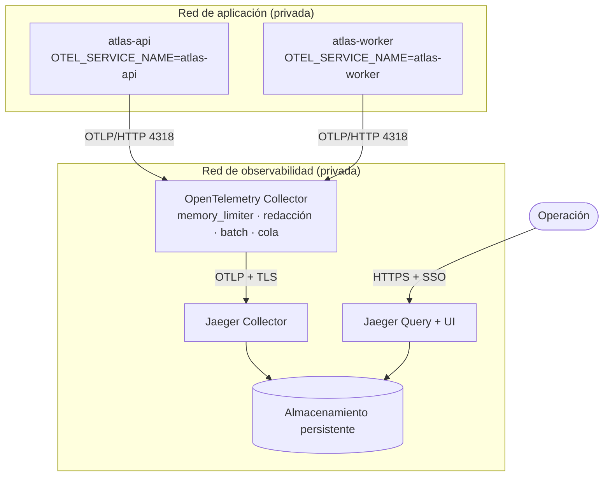

# Fase 16 — Topología de producción

El `all-in-one` de [`docker-compose.jaeger.yml`](../../docker-compose.jaeger.yml) guarda las
trazas **en memoria**: se pierden en cada reinicio y la memoria crece hasta el límite del
contenedor. Vale para desarrollo, demostraciones y pruebas locales. **No vale para producción.**

## Topología

## Componentes y puertos

| Componente | Puerto | Expuesto a | Notas |
| --- | --- | --- | --- |
| Collector — OTLP/HTTP | 4318 | Sólo la red de aplicación | El único destino que conoce el motor |
| Collector — OTLP/gRPC | 4317 | Sólo la red de aplicación | Alternativa si un emisor futuro la prefiere |
| Collector — health | 13133 | Sólo el orquestador | Sonda de readiness |
| Jaeger Collector | 4317 | Sólo el Collector | **Nunca** accesible desde la aplicación |
| Jaeger Query / UI | 16686 | Sólo tras el proxy de autenticación | Jamás en Internet sin SSO |
| Almacenamiento | según backend | Sólo Jaeger | Red privada de datos |

## Por qué el Collector

Se podría exportar directo a Jaeger, como en desarrollo. No se hace por tres razones:

1. **Desacople.** El motor exporta a un destino estable. Cambiar Jaeger de versión, de sitio o
   de backend no toca ni una variable de la aplicación.
2. **Absorción de fallos.** La cola con reintento vive en el Collector, no en el camino de la
   decisión. **La aplicación nunca depende de que Jaeger esté disponible.**
3. **Última red de privacidad.** Si un atributo sensible se cuela pese a los controles del
   código, se borra aquí antes de persistirse.

## Almacenamiento — decisión pendiente por diseño

Jaeger soporta oficialmente Elasticsearch/OpenSearch y Cassandra. **Este documento no elige
uno**, y la omisión es deliberada: desplegar un motor de búsqueda nuevo sólo para trazas es una
pieza de infraestructura con su propio ciclo de vida, su coste y su guardia.

Criterios de decisión, en orden:

| Criterio | Pregunta |
| --- | --- |
| **Reutilización** | ¿La organización ya opera Elasticsearch u OpenSearch? Si sí, la respuesta es esa: un índice más frente a un sistema más |
| **Volumen** | Spans/día × tamaño medio × retención. A 30 días define el dimensionado |
| **Retención** | 30 días (ver [política de privacidad](04-data-privacy-policy.md)). Más no aporta valor probatorio: la evidencia legal es la cadena de auditoría |
| **Coste operativo** | Quién responde cuando el almacenamiento se llena a las tres de la mañana |
| **Complejidad** | Cassandra escala mejor a volúmenes muy altos a cambio de una operación notablemente más exigente |

**Recomendación:** empezar con el almacén de búsqueda que la organización ya opere. Si no hay
ninguno, empezar con OpenSearch de un solo nodo, retención de 30 días e índices diarios, y
reevaluar con datos reales de volumen. Introducir Cassandra sin haber medido primero es
optimizar un problema que todavía no se tiene.

## Seguridad

- **TLS** entre Collector y Jaeger Collector (`tls.insecure: false` en la configuración).
- **Autenticación** delante de la UI: SSO corporativo mediante proxy inverso. Jaeger no trae
  autenticación propia y publicarlo sin ella expone todas las trazas a cualquiera que alcance
  el puerto.
- **Redes privadas.** El Collector no escucha en `0.0.0.0`: se liga a la interfaz interna que
  el despliegue inyecta en `OTEL_COLLECTOR_BIND_HOST`.
- **Nunca OTLP hacia Internet.**
- **Sin secretos en las trazas** — ver [04-data-privacy-policy.md](04-data-privacy-policy.md).

## Escalabilidad

| Presión | Respuesta |
| --- | --- |
| Más volumen de trazas | Bajar `OTEL_TRACES_SAMPLER_ARG`; es el control más barato y el primero que se toca |
| Collector saturado | Escalar horizontalmente detrás de un balanceador; es sin estado |
| Jaeger Collector saturado | Escalar réplicas; el almacenamiento suele ser el límite real |
| Almacenamiento lleno | Acortar retención antes de crecer; una traza de hace veinte días rara vez se consulta |
| Picos | `memory_limiter` + `sending_queue` absorben la ráfaga; si desborda, se descartan **trazas**, nunca peticiones |

## Recuperación

Las trazas son **datos operativos desechables**, no evidencia. Eso simplifica la estrategia:

- **Sin copia de seguridad.** Restaurar trazas de hace dos semanas no arregla ningún incidente.
  Lo que sí se respalda es la base de datos de decisiones, que es otra cosa.
- **Caída del Collector.** Los emisores no bloquean; los spans de esa ventana se pierden. Se
  restablece al recrear el contenedor.
- **Caída de Jaeger.** El Collector encola y reintenta hasta 5 minutos. Más allá, se pierden
  las trazas del intervalo. **Ninguna decisión de negocio se ve afectada** — verificado en la
  prueba de indisponibilidad (Fase 20).
- **Pérdida del almacenamiento.** Se recrea vacío. Se pierde el histórico de trazas, no la
  operación.
- **Objetivos:** RPO no aplicable (datos desechables); RTO igual al del despliegue.

## Coste operativo — cualitativo

| Elemento | Coste |
| --- | --- |
| Collector | Bajo. Sin estado, sin datos, se reinicia sin consecuencias |
| Jaeger Collector/Query | Bajo-medio. Escalado por réplicas |
| Almacenamiento | **El coste dominante**, tanto en infraestructura como en atención. Es lo que hay que dimensionar y vigilar |
| Muestreo | Palanca de coste más eficaz: bajar el ratio reduce almacenamiento proporcionalmente |

## Monitorización de la propia observabilidad

Un sistema de trazas que falla en silencio es peor que no tenerlo: da falsa confianza. Vigilar:

- `otelcol_exporter_send_failed_spans` — spans que no llegaron a Jaeger.
- `otelcol_processor_dropped_spans` — descartes por `memory_limiter`.
- Profundidad de `sending_queue` — si crece, Jaeger no absorbe.
- Uso del almacenamiento frente a la retención declarada.

Diagnóstico paso a paso en el [runbook operativo](06-operational-runbook.md).
