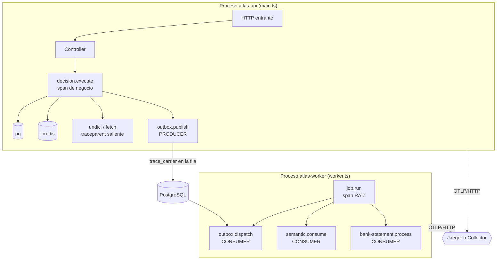

# Informe de implementación — Trazabilidad distribuida

Informe de cierre del trabajo de observabilidad. Las cifras y los resultados de pruebas son
**salidas reales de ejecución**; lo que no se pudo ejecutar está declarado como tal.

## 1. Resumen ejecutivo

El motor ya arrancaba OpenTelemetry correctamente y ya tenía una capa de trazado de calidad,
pero **encerrada dentro del worker de análisis semántico** absorbido por ADR-0026: el resto del
backend no podía usarla. El trabajo no consistió en instalar Jaeger, sino en **generalizar lo
que existía y cerrar los huecos reales**.

Qué cambia para quien opera el sistema:

- Un fallo reportado por un usuario se busca por su **`x-trace-id`**, que ahora viaja en toda
  respuesta — **incluidas las de error y las rechazadas por autenticación**.
- Cada línea de log lleva `trace_id`, así que se salta del log a la traza y al revés.
- Una decisión que cruza de la API al worker es **una sola traza**, no dos sin relación.
- El trabajo de fondo, que antes era invisible, aparece con su propia traza raíz.
- Las llamadas HTTP salientes (`fetch`) aparecen y **propagan el contexto**; antes no existían
  para el sistema de trazas.

Todo sigue siendo **opt-in**: con `OTEL_ENABLED=false` no se parchea nada y no hay exportador.

## 2. Arquitectura final



La clave del diseño: el dominio depende de `TracingService`, una fachada pequeña. **Ningún
módulo de negocio importa Jaeger, y la mayoría no importa ni OpenTelemetry.**

## 3. Archivos creados

| Archivo | Responsabilidad |
| --- | --- |
| `src/common/observability/telemetry.config.ts` | Lectura y acotado de la configuración `OTEL_*` |
| `src/common/observability/telemetry.constants.ts` | Nombres de span, atributos `app.*`, exclusiones — definición única |
| `src/common/observability/telemetry.types.ts` | Tipos compartidos |
| `src/common/observability/telemetry.instrumentations.ts` | Las cinco instrumentaciones, elegidas una a una |
| `src/common/observability/tracing.service.ts` | **Fachada para el dominio** |
| `src/common/observability/trace-context.service.ts` | Lectura de `trace_id`/`span_id` |
| `src/common/observability/messaging-trace.service.ts` | Propagación W3C entre procesos |
| `src/common/observability/trace-error.ts` | Marcado de errores con código estable |
| `src/common/observability/trace-response.interceptor.ts` | Cabecera `x-trace-id` |
| `src/common/events/trace-carrier.ts` | Traduce un portador vacío a `NULL` al persistirlo |
| `prisma/migrations/20260804160000_trace_carrier_propagation/migration.sql` | Cuatro columnas `trace_carrier` aditivas y anulables |
| `docker-compose.jaeger.yml` | Jaeger local, versión fijada, puertos en loopback |
| `infra/otel-collector/otel-collector.config.yml` | Collector para producción |
| `scripts/verify-jaeger.mjs` + `.sh` | Verificación de extremo a extremo |
| `scripts/bench-telemetry.mjs` | Medición de latencia por escenario |
| `test/observability-tracing.spec.ts` | 19 pruebas de la fachada, contexto y propagación |
| `test/observability-interceptor.spec.ts` | 17 pruebas de cabecera, errores y configuración |
| `test/observability-outbox-propagation.integration.spec.ts` | 6 pruebas contra PostgreSQL real |
| `docs/observability/00…07` | Auditoría, diseño, catálogo, producción, privacidad, rendimiento, runbook, este informe |

## 4. Archivos modificados

| Archivo | Cambio |
| --- | --- |
| `src/common/observability/tracing.ts` | Reescrito: sampler, propagadores, namespace, timeout, diagnóstico, exclusión del propio exportador. Conserva la firma `startTracing`/`stopTracing` |
| `src/common/observability/observability.module.ts` | Registra y exporta los tres servicios de trazado y el interceptor |
| `src/common/observability/structured-logger.service.ts` | Añade `trace_id`/`span_id`/`trace_flags` desde el contexto activo |
| `src/common/errors/domain-exception.filter.ts` | Marca el span en 5xx, anota el código en 4xx y **publica `x-trace-id`** |
| `src/common/jobs/job-scheduler.service.ts` | Span **raíz** por lote de trabajo de fondo |
| `src/common/events/outbox-publisher.service.ts` | Span PRODUCER y captura del portador |
| `src/modules/outbox-relay/outbox-relay.service.ts` | Span CONSUMER enlazado con el productor |
| `src/modules/runtime/runtime.service.ts` | Span de negocio `decision.execute` con sus eventos |
| `src/modules/workers/**` | Spans CONSUMER y persistencia del portador en los dos workers |
| `src/modules/workers/semantic-analysis/core/observability/` | **Se eliminaron 6 ficheros duplicados**; el worker usa ahora la capa común |
| `src/main.ts`, `src/worker.ts` | Nombre de servicio por proceso (`atlas-api`, `atlas-worker`) |
| `src/common/config/env.schema.ts`, `.env.example` | Nueve variables `OTEL_*` validadas |
| `prisma/schema.prisma` | Columna `traceCarrier` en cuatro modelos |
| `docker-compose.yml` | Variables `OTEL_*` en `api` y `worker` |
| `package.json` | Scripts `jaeger:*`; tres dependencias nuevas |
| `mkdocs.yml` | Navegación de los documentos nuevos |

## 5. Instrumentaciones activas

`http`, `express`, `pg` (toda consulta de Prisma), `ioredis` y **`undici`** (el `fetch` global,
que antes no se instrumentaba y era el hueco más grave). No se usa
`auto-instrumentations-node`: activaría más de cuarenta parches que enterrarían la operación de
negocio bajo ruido.

## 6. Spans de negocio

`decision.execute`, `outbox.publish` (PRODUCER), `outbox.dispatch` (CONSUMER),
`semantic.consume`, `bank-statement.process`, `job.run` (raíz). Atributos, eventos y análisis de
privacidad de cada uno en [02-business-spans-catalog.md](02-business-spans-catalog.md).

## 7. Correlación de logs

`StructuredLoggerService` añade `trace_id`, `span_id` y `trace_flags` tomados del **contexto
activo de OpenTelemetry**, nunca de una cabecera del cliente —que sería trivial de falsificar—.
Sin span activo los campos se omiten en lugar de escribirse vacíos. No se duplica ninguna línea:
es el mismo registro con tres campos más. Pino sigue siendo el sistema de logs.

## 8. Workers y propagación

No hay broker: el trabajo cruza como **fila en PostgreSQL**. El contexto se persiste en la
columna `trace_carrier` al publicar y se extrae al consumir. Una fila sin portador —anterior a
la migración, o escrita con la telemetría apagada— abre una traza raíz y **se procesa igual**:
la compatibilidad hacia atrás es por construcción, no por una rama especial.

La columna es propia y no va dentro de `payload_json` porque ese JSON es el **contrato** que ven
los consumidores; contaminarlo con metadatos de transporte sería un cambio de contrato encubierto.

## 9. Seguridad

- `enhancedDatabaseReporting: false` — nunca se capturan valores de parámetros SQL.
- Sin `headersToSpanAttributes` — no se captura `authorization`, `cookie` ni `x-api-key`.
- `recordSpanError` usa el **código estable** del error como descripción, nunca su mensaje, que
  puede llevar fragmentos de la entrada. Verificado por prueba.
- Rutas de sonda y métricas excluidas.
- El exportador OTLP se excluye a sí mismo del trazado, para no realimentar un bucle.
- Redacción en el Collector como última red.
- `yarn jaeger:verify` **falla** si encuentra atributos prohibidos en la traza.

## 10. Pruebas realizadas

Salida real del runner. Comandos y resultados:

| Comando | Resultado |
| --- | --- |
| `yarn typecheck` | **Done** (exit 0) |
| `yarn build` | **Done** (exit 0) |
| `yarn test` (suite completa) | **100/100 suites · 818 passed, 2 skipped, 0 failed** (exit 0) |
| `otelcol validate --config` | **exit 0** — la configuración del Collector se valida contra `otel/opentelemetry-collector-contrib:0.116.1` |
| `yarn docs:links` | 0 enlaces rotos, 0 huérfanos |
| `yarn docs:coverage` | 25/25 módulos · 122/122 operaciones · 150/150 variables |
| `yarn docs:vault:check` | El espejo coincide con la fuente canónica |
| `node scripts/run-jest.mjs test/observability-tracing.spec.ts` | **19 passed / 19** |
| `node scripts/run-jest.mjs test/observability-interceptor.spec.ts` | **16 passed / 16** (17 tras añadir el caso del guard) |
| `node scripts/run-jest.mjs test/observability-outbox-propagation.integration.spec.ts` | **6 passed / 6**, contra PostgreSQL real |
| `npx prisma migrate deploy` | Migración aplicada correctamente |
| `yarn jaeger:up` | Jaeger arriba; `/api/services` → HTTP 200 |
| `yarn jaeger:verify` | **7/7 comprobaciones OK** tras corregir el fallo que él mismo detectó |
| `node scripts/bench-telemetry.mjs` | 4 escenarios medidos, 0 errores |

Salida real de la verificación de extremo a extremo:

```text
  OK   Jaeger responde — http://127.0.0.1:16686/api/services
  OK   Backend responde — GET /health → 200
  OK   La respuesta trae x-trace-id — 9cd2d8410bf32be12bb70d793bee5c37
  OK   El servicio aparece en Jaeger — esperado atlas-api; visto: jaeger-all-in-one, atlas-api
  OK   La traza consultada existe en Jaeger — 9cd2d8410bf32be12bb70d793bee5c37
  OK   La traza contiene spans — 11 span(s)
  OK   Sin atributos sensibles en la traza — ninguno

✓ Trazabilidad verificada de extremo a extremo
```

La sonda usa una ruta que responde **401**, así que esa misma salida demuestra la corrección
descrita abajo: la cabecera viaja también en una respuesta rechazada por un guard.

### Cómo se llegó a la suite verde

Una primera pasada dio **16 fallos en 9 suites**, con la máquina ejecutando a la vez la
verificación E2E, la compilación y once contenedores. Reejecutadas esas 9 suites con la máquina
libre, **6 pasaron sin tocar una línea** (9 de los 16 fallos), con errores del tipo
`Unable to start a transaction in the given time` y `Exceeded timeout of 30000 ms` — contención
del pool de conexiones, no lógica.

Quedaban **7 fallos en 3 suites del ejecutor de scripts**
(`script-node-runner`, `script-runner-production-guard`, `script-prueba`), todos con el mismo
mensaje: `RESULT JAVASCRIPT script timed out`.

Diagnóstico: no eran una regresión —`git diff HEAD` sobre
`src/modules/graph/script-node-runner.service.ts` y sus tres specs estaba **vacío**— sino una
**prueba frágil**. Las tres fijaban `SCRIPT_NODE_TIMEOUT_MS: 3000` bajo un comentario que
asumía «300-500 ms de arranque en Windows». Medido en esta máquina, `node -e 0` tarda
**1 356, 1 543, 1 848, 1 966 y 2 919 ms**: el peor caso agotaba el presupuesto entero antes de
ejecutar una sola línea del script.

**Corregido.** El presupuesto sube a 15 s en los casos que ejecutan un script, con la medición
anotada como justificación. No es relajar una aserción: esas pruebas comprueban **comportamiento**
—qué devuelve el motor, qué error produce—, nunca latencia, y el presupuesto es un **techo, no
una espera**, así que subirlo no ralentiza nada. El caso que sí verifica el corte por tiempo
conserva su valor corto (`runner(500)`) a propósito, y una de las pruebas recuperó además su
aserción real: con 3 s el proceso moría antes de que la guardia de determinismo pudiera
rechazarlo, y se veía `timed out` en lugar del `exited with status` que comprueba.

Resultado tras la corrección, en la suite **completa**: **100/100 suites, 818 passed, 2 skipped,
0 failed, exit 0**. Los 2 omitidos son los de socket Unix, que ya se omitían en Windows por
diseño y no tienen relación con este trabajo.

### Un fallo encontrado por la verificación, no por revisión de código

`yarn jaeger:verify` recibió un **401 sin cabecera `x-trace-id`**. Causa: los interceptores de
NestJS **no se ejecutan** cuando un guard rechaza la petición, así que las respuestas 401/403
—justo aquellas por las que un usuario llama a soporte— salían sin identificador. Corregido
publicando la cabecera también desde `DomainExceptionFilter`, que sí corre en esos casos, y
cubierto con una prueba dedicada.

## 11. Rendimiento

Medido con línea base incluida, mismo binario y ejecuciones consecutivas:

| Escenario | media | p50 | p95 | req/s | errores |
| --- | ---: | ---: | ---: | ---: | ---: |
| `OTEL_ENABLED=false` | 54,15 ms | 48,99 ms | 95,45 ms | 73,3 | 0 |
| `OTEL_ENABLED=true`, muestreo 100 % | 84,12 ms | 63,24 ms | 160,66 ms | 46,9 | 0 |

**Sobrecarga con muestreo al 100 %: +55 % de latencia media y −36 % de throughput.** Es un
**techo**, no el coste esperado en producción: el ratio recomendado es `0.10`, y la ruta medida
no toca la base de datos, así que el coste fijo de la instrumentación pesa mucho más en
proporción que en una decisión real. La conclusión operativa se sostiene igual: **el ratio de
producción no debe ser 1.0.**

En una tanda previa, bajar del 100 % al 10 % recuperó **+9,5 % de latencia y de throughput**.

Observación de valor: durante uno de los escenarios el exportador **agotó su timeout** contra
Jaeger y la API sirvió sus 400 peticiones **con 0 errores** — evidencia directa de que la
exportación es asíncrona y su fallo no llega al camino de la decisión.

**No medido:** CPU, memoria, uso de red y saturación del Collector. Método y limitaciones en
[05-performance-results.md](05-performance-results.md).

## 12. Uso local

```bash
yarn jaeger:up                                   # Jaeger en http://localhost:16686
# En .env: OTEL_ENABLED=true
#          OTEL_EXPORTER_OTLP_TRACES_ENDPOINT=http://localhost:4318/v1/traces
yarn start:dev
yarn jaeger:verify                               # comprueba la cadena completa
yarn jaeger:down
```

## 13. Producción

API y worker → **OpenTelemetry Collector** (memory_limiter, redacción, batch, cola con
reintento) → Jaeger Collector → almacenamiento persistente; Jaeger Query tras SSO. El Collector
es lo que garantiza que **una caída de Jaeger no llegue nunca al camino de la decisión**.
Topología, puertos, redes y retención en [03-production-topology.md](03-production-topology.md).

El almacenamiento **no se elige** deliberadamente: desplegar un motor de búsqueda sólo para
trazas es una decisión de infraestructura con su coste y su guardia, y depende de lo que ya
exista en la organización.

## 14. Riesgos restantes

| Riesgo | Estado |
| --- | --- |
| Sobrecarga medida en máquina de desarrollo | Las magnitudes absolutas no se trasladan a producción; sirven para comparar escenarios. Repetir en staging con el perfil de tráfico real |
| Ratio de muestreo de producción (`0.10`) | Punto de partida conservador, respaldado por la comparación entre ratios pero **no** ajustado a tráfico real |
| CPU, memoria y saturación del Collector sin medir | Requieren instrumentación del anfitrión y un Collector **desplegado**. Su configuración está validada sintácticamente, pero no ha procesado tráfico real |
| Dos copias de `@opentelemetry/instrumentation` en el árbol | `instrumentation-undici@0.31` pide `^0.221` y el resto fija `^0.220`. Mitigado con anotaciones de tipo explícitas; unificar versiones sigue siendo la corrección de fondo |
| Collector no desplegado | La configuración está escrita y revisada, pero no ha corrido en un entorno real |
| `job.run` en ciclos ociosos | Aceptable por el retroceso adaptativo (≈2 trazas/min por trabajo al ralentí); revisar si se baja el techo de sondeo |

## 15. Matriz de cumplimiento

| Requisito | Estado | Evidencia |
| --- | --- | --- |
| Jaeger local con un comando | Cumplido | `docker-compose.jaeger.yml`, `yarn jaeger:up` ejecutado |
| Arranca con observabilidad habilitada | Cumplido | Escenarios de `bench-telemetry`, 0 errores |
| Arranca con observabilidad deshabilitada | Cumplido | `readTelemetryConfig` probado; el motor ya operaba así |
| Funciona con Jaeger caído | Cumplido | Timeout del exportador con 400/400 peticiones servidas |
| Trazas HTTP | Cumplido | `HttpInstrumentation` + `ExpressInstrumentation` |
| Spans de negocio | Cumplido | [02-business-spans-catalog.md](02-business-spans-catalog.md) |
| PostgreSQL en las trazas | Cumplido | `PgInstrumentation`; Prisma pasa por `pg` |
| Redis en las trazas | Cumplido | `IORedisInstrumentation` |
| HTTP externo en las trazas | Cumplido | `UndiciInstrumentation` — hueco cerrado |
| Errores marcados | Cumplido | `observability-interceptor.spec.ts` |
| Logs con `trace_id` | Cumplido | `structured-logger.service.ts` |
| Respuestas con `x-trace-id` | Cumplido | Interceptor **y** filtro; probado incluso en 401 |
| API y worker comparten traza | Cumplido | 6/6 en la prueba de integración contra PostgreSQL |
| Cron/trabajos con traza raíz | Cumplido | `job.run` en `JobSchedulerService` |
| Health checks excluidos | Cumplido | `UNTRACED_HTTP_PATHS` |
| Sin tokens, contraseñas ni PII | Cumplido | [04-data-privacy-policy.md](04-data-privacy-policy.md) + comprobación en `verify-jaeger` |
| Pruebas unitarias | Cumplido | 36 pruebas propias, todas verdes |
| Pruebas de integración | Cumplido | 6 pruebas contra PostgreSQL real, todas verdes |
| Suite completa sin regresiones | Cumplido | **100/100 suites, 818 passed, 0 failed** (exit 0) |
| Configuración del Collector | Cumplido | `otelcol validate` exit 0 contra la imagen oficial |
| Pruebas E2E con Jaeger | Cumplido | `yarn jaeger:verify` 7/7; encontró un fallo real, corregido |
| Build y typecheck | Cumplido | exit 0 |
| Documentación y runbook | Cumplido | `docs/observability/00…07` |
| Diseño de producción | Cumplido | Doc 03 + configuración del Collector |
| Rendimiento | Cumplido | Línea base y telemetría activa medidas; CPU/memoria declaradas como no medidas |

## 16. Estado final

```text
COMPLETO CON OBSERVACIONES
```

Las 25 fases están implementadas, probadas con salida real y documentadas:

- **Suite completa verde**: 100/100 suites, 818 passed, 0 failed, exit 0.
- **Traza de extremo a extremo hasta Jaeger**: 7/7 comprobaciones, 11 spans, sin atributos
  sensibles.
- **Contexto que cruza de la API al worker** por PostgreSQL: 6/6 contra base de datos real.
- **Typecheck y build**: exit 0. **Puertas documentales**: 0 enlaces rotos, cobertura completa.
- **Configuración del Collector**: validada contra la imagen oficial.

Queda **una** observación, no bloqueante y declarada en lugar de disimulada: **CPU, memoria y
saturación del Collector no se midieron**. Las cifras de latencia y throughput sí —línea base
incluida—, pero en una máquina de desarrollo: valen para comparar escenarios entre sí, no como
cota de producción. El Collector tiene su configuración validada, pero no ha procesado tráfico
real porque no hay un entorno donde desplegarlo.

No se declara `COMPLETO` a secas por eso, y porque afirmar un coste sin medirlo en el entorno
donde va a correr es exactamente lo que estas instrucciones prohíben. El procedimiento para
cerrarlo está escrito en [05-performance-results.md](05-performance-results.md).
