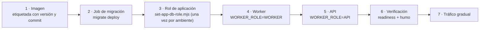

# Despliegue

## Orden obligatorio



El paso 2 es un **Job separado**, no parte del arranque de la API: migrar desde el arranque
haría que N réplicas compitieran por el mismo bloqueo.

El worker antes que la API es preferible pero no obligatorio: mientras no haya worker, los
eventos se acumulan en el outbox sin perderse.

## Dos cargas, una imagen

| Carga | Arranque | `WORKER_ROLE` | Puerto |
| --- | --- | --- | --- |
| `api` | `node dist/main.js` | `API` | 3000 |
| `worker` | `node dist/worker.js` | `WORKER` | 3001 (solo sondas) |

Publicar **una sola imagen** es deliberado: dos permitirían que una corriera código más viejo
que la otra sobre el mismo esquema.

## Compose

```bash
docker compose up -d                     # stack completo
docker compose --profile seed run seed   # siembra explícita
docker compose up --scale worker=3 -d    # escalar solo el fondo
```

Ningún secreto tiene valor por defecto: falta uno y el arranque se detiene con el nombre exacto.

## Kubernetes

`deploy/kubernetes/`: `configmap.yaml` (no sensible), `deployment.yaml` (API),
`worker-deployment.yaml`, `service.yaml`, `hpa.yaml`, `pdb.yaml`, `network-policy.yaml`,
`migration-job.yaml`. Los secretos vienen de `atlas-decision-secrets`, creado fuera del
repositorio.

El worker usa estrategia `Recreate`: dos generaciones compitiendo por las mismas filas no
aportan disponibilidad, y su periodo de gracia (60 s, mayor que el de la API) deja drenar los
trabajos en vuelo.

## Verificación posterior

```bash
curl -f "$BASE_URL/health/live"    # comprobar también el campo "role"
curl -f "$BASE_URL/health/ready"
yarn smoke
```

Y observar durante la ventana de despliegue: tasa de error, p95/p99, `NO_DECISION`,
`atlas_outbox_pending`.

## Antes de declarar el despliegue correcto

- [ ] Migración completada **antes** de que arrancara la aplicación
- [ ] `/health/ready` responde en API y worker
- [ ] Existe al menos un proceso con rol `WORKER` o `ALL`
- [ ] `atlas_outbox_pending` no crece de forma sostenida
- [ ] La prueba de humo pasa
- [ ] Checksum de la imagen y aprobaciones registrados

## Rollback

El de la imagen **no** revierte el esquema. Ver [reversión](rollback.md).
