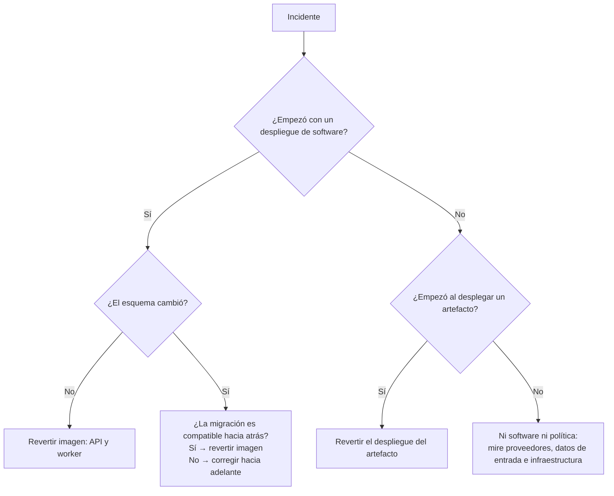

# Reversión

## Tres reversiones distintas

!!! danger "No las confunda"
    | Qué se revierte | Alcance | Reversible |
    | --- | --- | --- |
    | **Imagen** | El software | Sí, si el esquema es compatible |
    | **Despliegue de un artefacto** | Qué versión decide en un ambiente | Sí, siempre |
    | **Esquema** | La base de datos | **No** de forma segura |

## 1. Revertir la imagen

```bash
kubectl rollout undo deployment/atlas-decision-api
kubectl rollout undo deployment/atlas-decision-worker
```

**El rollback de imagen no revierte el esquema.** Por eso toda migración debe ser compatible
con la versión anterior de la aplicación; para un cambio destructivo se usa *expand/contract*
(ver [migraciones](../data/migrations.md)).

Revierta **ambas** cargas: dejar el worker con código nuevo y la API con código viejo es una
combinación que nadie ha probado.

## 2. Revertir el despliegue de un artefacto

Es la reversión de negocio y la más frecuente: una política nueva decide peor de lo esperado.

- No toca el software ni el esquema.
- Reactiva el despliegue de la versión anterior, que sigue **compilada e inmutable**.
- Las decisiones ya tomadas **no cambian**: cada ejecución guarda con qué versión se decidió.

Es rápido y seguro porque el artefacto anterior nunca se modificó.

## 3. «Revertir» el esquema

No hay reversión segura de una migración aplicada sobre datos reales. Si una migración
destructiva llegó a producción:

1. Restaurar desde respaldo, asumiendo la pérdida de lo escrito desde entonces.
2. O escribir una migración correctora hacia adelante.

La segunda casi siempre es preferible: la primera descarta decisiones ya comunicadas al canal.

## Decidir qué revertir



## Después de revertir

- [ ] `/health/ready` en API y worker
- [ ] Prueba de humo
- [ ] `atlas_outbox_pending` no crece
- [ ] Verificar la cadena de auditoría si hubo restauración de datos
- [ ] Registrar qué se revirtió, por qué y qué evidencia se conservó
