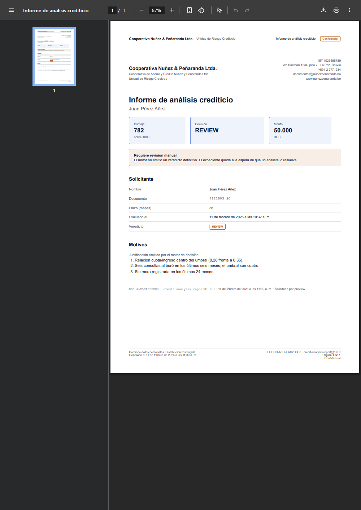
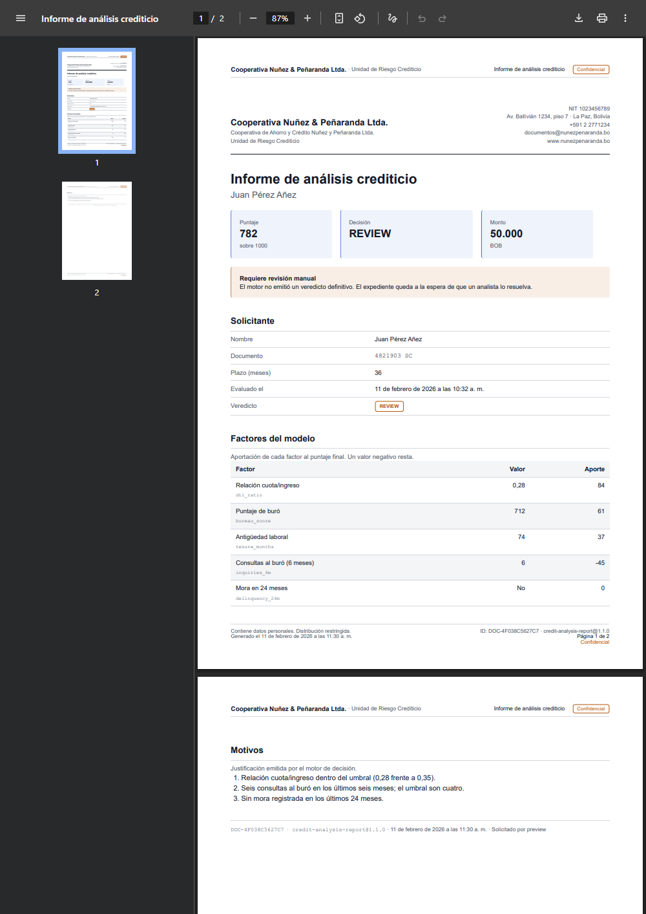
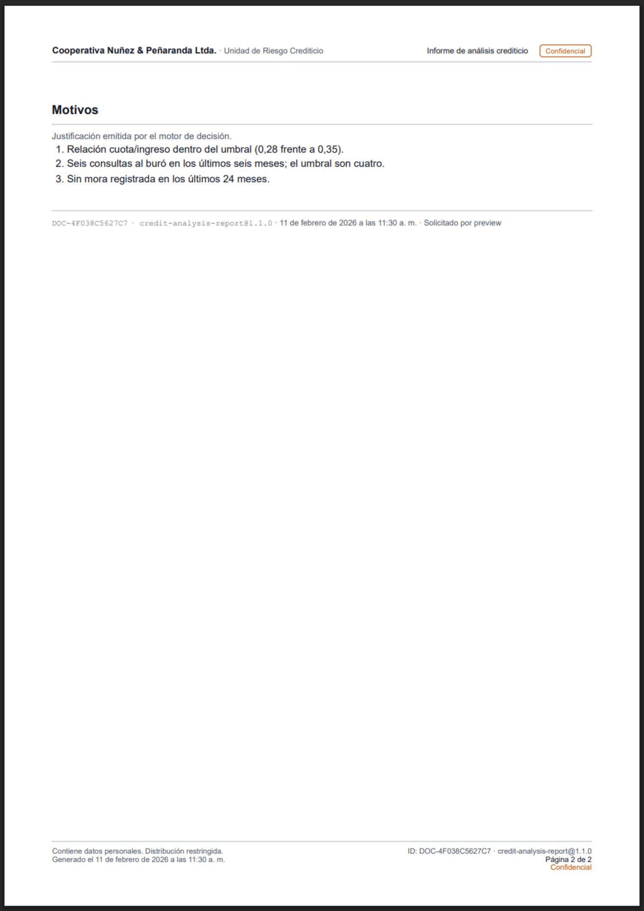
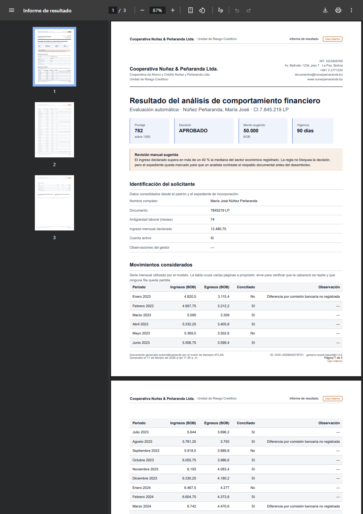
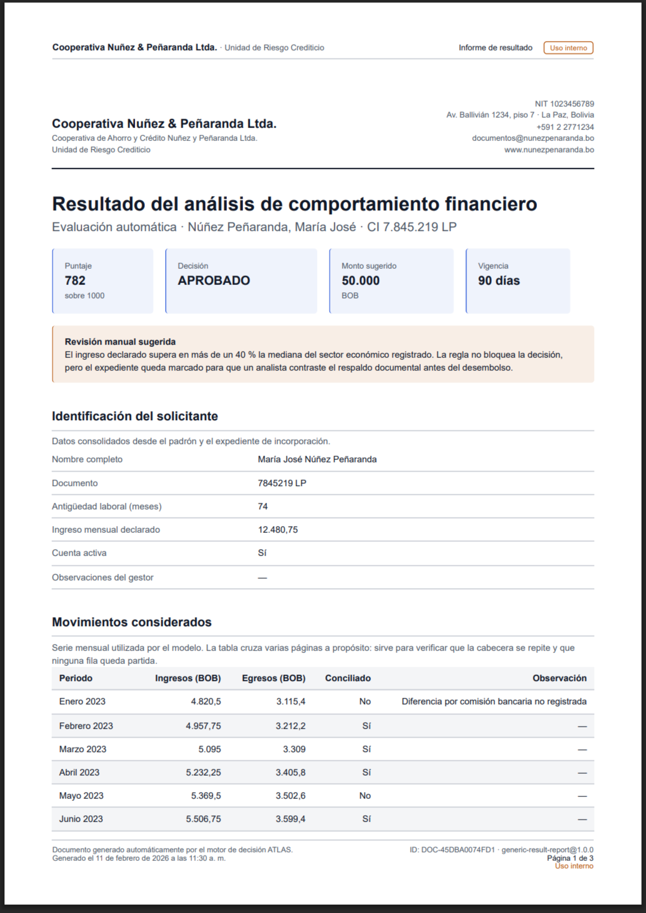
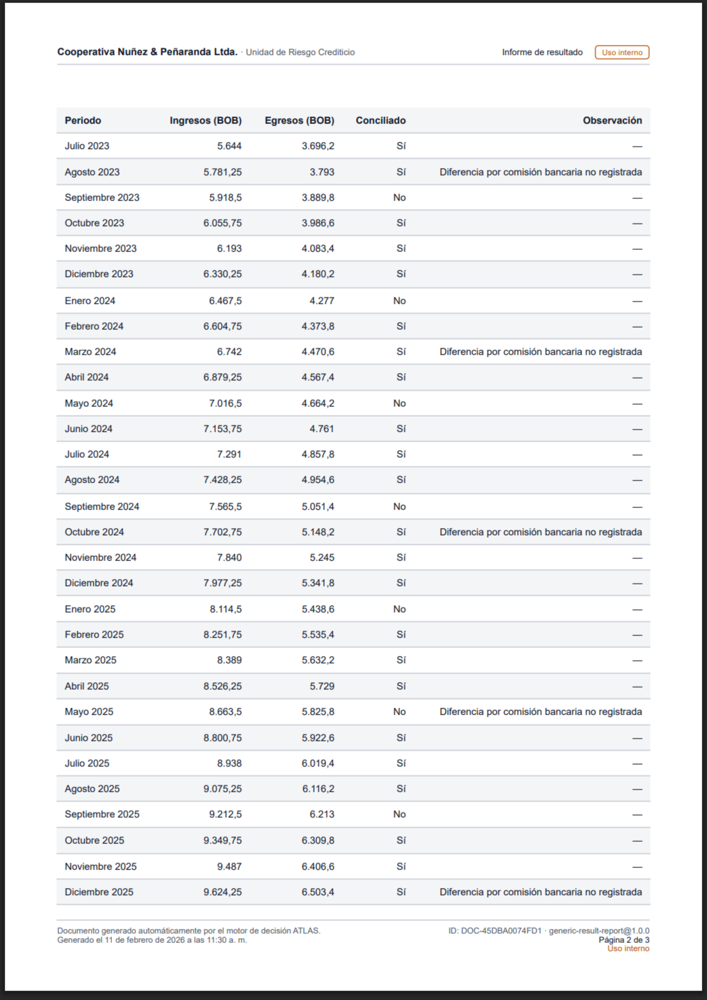
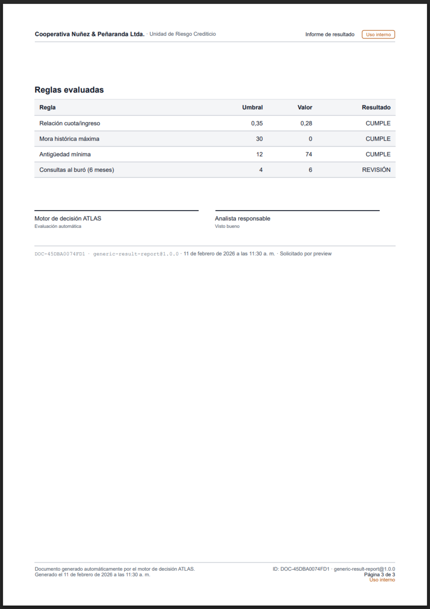

# Evidencia del PDF Generator Worker

Generada por `yarn pdf:evidencia`. Cada PDF sale del camino COMPLETO —el mismo que atiende
`POST /pdf/generate`— con el reloj congelado en `2026-02-11T15:30:00Z` para que dos corridas
sean comparables.

Las capturas son del **visor de PDF del navegador con el archivo abierto**, no del HTML de
partida. Es la diferencia entre enseñar lo que se pintó en pantalla y lo que quedó impreso:
los saltos de página, la cabecera de tabla repetida, el membrete y el pie en los márgenes y
«Página X de Y» sólo existen después de paginar.

| Template | Páginas | Bytes | Render | Checksum (SHA-256) |
| --- | ---: | ---: | ---: | --- |
| `credit-analysis-report@1.0.0` | 1 | 108.708 | 1151 ms | `bfc114afb0bff2bf…` |
| `credit-analysis-report@1.1.0` | 2 | 113.729 | 716 ms | `808727824e8ab615…` |
| `generic-result-report@1.0.0` | 3 | 109.597 | 908 ms | `0876f36e6d9f36cd…` |

## Capturas

### credit-analysis-report@1.0.0 — credit-analysis-report-1.0.0-visor.png

### credit-analysis-report@1.0.0 — credit-analysis-report-1.0.0-pagina-1.png

### credit-analysis-report@1.1.0 — credit-analysis-report-1.1.0-visor.png

### credit-analysis-report@1.1.0 — credit-analysis-report-1.1.0-pagina-1.png

### credit-analysis-report@1.1.0 — credit-analysis-report-1.1.0-pagina-2.png

### generic-result-report@1.0.0 — generic-result-report-1.0.0-visor.png

### generic-result-report@1.0.0 — generic-result-report-1.0.0-pagina-1.png

### generic-result-report@1.0.0 — generic-result-report-1.0.0-pagina-2.png

### generic-result-report@1.0.0 — generic-result-report-1.0.0-pagina-3.png

