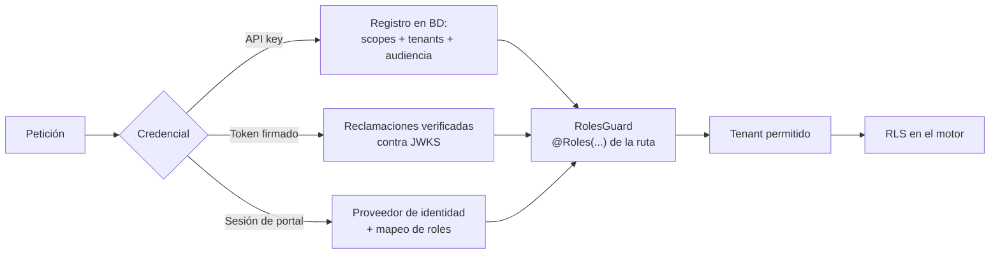

# Control de acceso

Complementa [autorización](../api/authorization.md) con la vista de seguridad.

## Modelo

Control de acceso **basado en roles**, decidido en el servidor y con los roles resueltos de una
fuente autorizada —nunca del llamante.

## Audiencias

Una API key tiene audiencia `management` o `runtime`. Una clave de runtime **no puede**
administrar aunque se le concediera el rol: la audiencia se comprueba antes.

Los tokens firmados usan audiencias distintas para gestión y runtime
(`JWT_MANAGEMENT_AUDIENCE`, `JWT_RUNTIME_AUDIENCE`).

## El comodín y su frontera

`PLATFORM_ADMIN` sustituye a cualquier rol exigido **solo en identidades firmadas**. En una
API key no se honra.

Consecuencia práctica: el cliente de gestión de arranque recibe **explícitamente** cada rol de
plataforma, porque de otro modo una instalación nueva no podría administrar nada antes de
conectar el proveedor de identidad.

Cubierto por `test/api-key-privilege-escalation.spec.ts`.

## Auditoría de denegaciones

Todo `401`/`403` se registra en `decision_access_audit` con estado, recurso, IP y momento.

- La escritura es *fire-and-forget*: la respuesta no espera, y un fallo de auditoría **nunca** cambia el estado devuelto.
- Si la base no está disponible, una cola acotada (`ACCESS_AUDIT_QUEUE_MAX`) absorbe el hueco y reintenta cada `ACCESS_AUDIT_RETRY_SECONDS`.
- La cota existe para que la red de seguridad no se convierta en un consumo de memoria sin límite bajo ataque.

Un pico de denegaciones se investiga por estado, recurso, IP y ventana, correlacionando con
`x-request-id`.

!!! danger "Mitigación que NO se debe aplicar"
    Habilitar `x-roles` o `x-principal-id` «para desbloquear a un integrador». Esas cabeceras no
    son una fuente de identidad y aceptarlas anula todo el modelo.

## Revisión de accesos

| Qué revisar | Dónde | Cadencia sugerida |
| --- | --- | --- |
| Clientes de integración activos y sus scopes | `integration_client`, `integration_scope` | Trimestral |
| Tenants concedidos por cliente | `integration_tenant_access` | Trimestral |
| Credenciales sin uso reciente | `lastUsedAt` | Trimestral |
| Denegaciones anómalas | `decision_access_audit` | Continua, por alerta |
