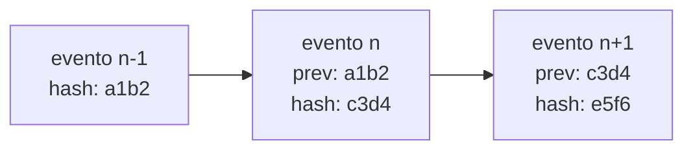

# Auditabilidad

## Qué garantiza la cadena

`decision_audit_event` es una secuencia **append-only encadenada por hash, por tenant**. Cada
evento incluye el hash del anterior, de modo que alterar o eliminar uno rompe la verificación
de todos los posteriores.



## Cómo se hace efectiva

No depende de que el código «no borre»:

| Control | Mecanismo |
| --- | --- |
| Sin `UPDATE` ni `DELETE` | Disparadores en la tabla **y** `REVOKE` sobre el rol de aplicación |
| Aislamiento | RLS por tenant |
| Atomicidad | El evento se escribe en la **misma transacción** que el cambio que audita |
| Verificabilidad tras rotar la clave | Cada evento guarda el `keyId` con el que se firmó |

!!! important "Dos consecuencias operativas que sorprenden"
    1. **La limpieza de una prueba no puede purgar filas de auditoría.** Por eso las suites que
       escriben auditoría usan identificadores de tenant únicos por corrida: no pueden borrar
       lo que dejaron.
    2. **La retención no puede significar borrado.** Solo archivado y exportación.

## Verificar

```bash
curl "$BASE_URL/v1/audit/chain/verify" \
  -H "authorization: Bearer $TOKEN" -H "x-tenant-id: 1"
```

Recorre la cadena **por lotes** (`AUDIT_VERIFY_BATCH_SIZE`, 500) y no cargando el historial
completo en memoria: sobre una tabla regulatoria, hacerlo sería un DoS trivial contra uno mismo.

## Rotación de la clave de firma

Ver [gestión de secretos](secrets-management.md). Lo esencial: los secretos retirados se
conservan **solo para verificar**; nunca vuelven a firmar. Un evento cuyo `keyId` ya no está
configurado no se puede verificar, y eso se informa como tal en vez de darlo por válido.

## Qué se audita

| Hecho | Dónde |
| --- | --- |
| Cambios de gobierno (envío, voto, aprobación, rechazo) | `decision_audit_event` |
| Ejecuciones de decisión | `decision_execution` y sus satélites |
| Denegaciones de acceso | `decision_access_audit` |
| Corridas de QA y contraejemplos | Tablas de QA Lab |

## Si la verificación falla

Es un **incidente de integridad**, no un fallo de aplicación:

1. Declarar el incidente.
2. Congelar rotaciones y cualquier tarea que toque evidencia.
3. Exportar una instantánea de solo lectura con sus hashes.
4. Investigar escrituras directas a la base, restauraciones parciales o manipulación.
5. **Nunca** recalcular hashes «para que cuadre»: eso destruye la propiedad que hace útil la cadena.

Ver el [runbook de operación](../runbooks/OPERATIONS.md).
