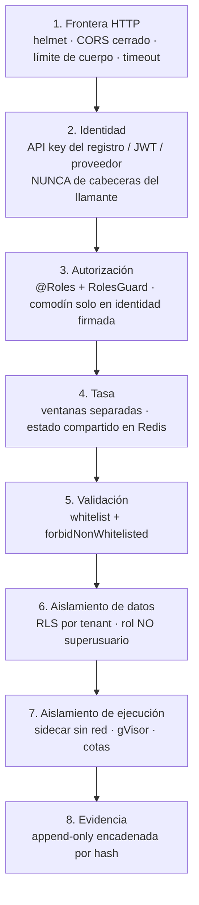

# Arquitectura de seguridad

## Activos que hay que proteger

| Activo | Por qué importa | Impacto si se compromete |
| --- | --- | --- |
| Cadena de auditoría | Es la evidencia regulatoria de cada decisión | Pérdida de defendibilidad ante el regulador |
| Artefactos y su lógica | Política crediticia de la entidad | Decisiones manipuladas; ventaja para el fraude |
| Datos personales de solicitantes | Obligación legal | Sanción y daño reputacional |
| Credenciales de integración | Acceso al plano de decisión | Decisiones fraudulentas a escala |
| Secreto de firma de auditoría | Verificabilidad de la cadena | Evidencia inverificable |

## Controles por capa

Son independientes a propósito: la capa 6 protege aunque falle la 3.

## Decisiones de seguridad y su razón

| Decisión | Razón |
| --- | --- |
| El llamante no declara identidad ni roles | Una cabecera convertiría cualquier integración en administrador |
| `PLATFORM_ADMIN` solo en identidad firmada | Una API key es un secreto compartido en la configuración de un tercero |
| RLS con rol no superusuario | RLS es **inerte** para un superusuario: el aislamiento sería ficticio |
| Sidecar para el código importado | Un `vm` de Node **no** es una frontera del sistema operativo |
| `IN_PROCESS` prohibido en producción | Doble control: esquema de entorno **y** guarda en el servicio |
| HMAC en valores sensibles | Un SHA-256 desnudo de baja entropía es reversible |
| Sin mensaje interno en un `500` en producción | Revela host, puerto, versión y fragmentos de consulta |
| Swagger prohibido en producción | Reduce superficie y evita exponer el mapa completo de la API |
| Un recurso ajeno responde `404` | Un `403` confirmaría que existe |

## Endurecimiento del sandbox de scripts

El runner ha sido endurecido contra escapes reales, no teóricos:

- **JavaScript**: todo objeto que cruza al sandbox se copia con prototipo nulo. `Object.freeze` no basta: un objeto congelado conserva su prototipo y con él la ruta `constructor.constructor`, el escape clásico de `vm`.
- **Python**: se bloquean `import`, `class`, `with`, `try`, atributos dunder y **`str.format`/`format_map`** — el escape clásico por introspección de clases, que ningún nodo `Attribute` del AST delata porque viaja dentro de una cadena literal.
- **Determinismo**: `Math.random` lanza dentro del sandbox; sin ello una decisión no sería reproducible.
- **Memoria**: `--max-old-space-size` en JS y `RLIMIT_AS` en Python. Sin cota, un script desbocado se lleva por delante el contenedor entero y las ejecuciones de otros tenants.

## Lo que la plataforma NO protege

- No sustituye al WAF, al mTLS ni al gestor de secretos de la organización.
- No cifra en reposo por sí misma: eso corresponde al almacenamiento.
- No valida que la política de negocio sea correcta, solo que se aplique como fue aprobada.
